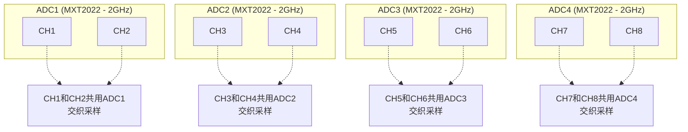
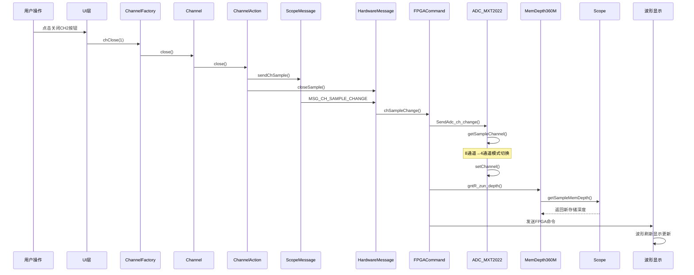
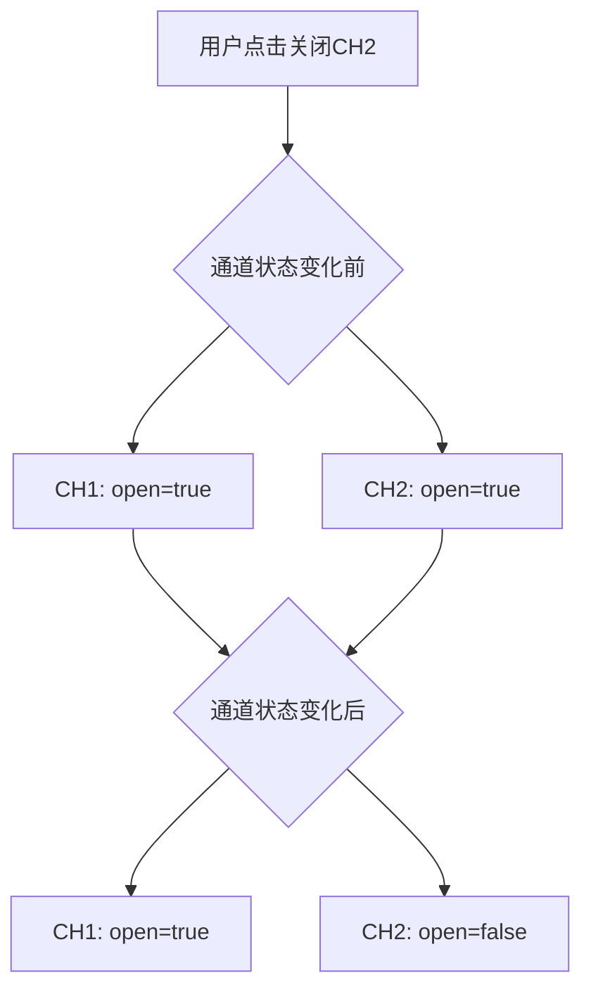
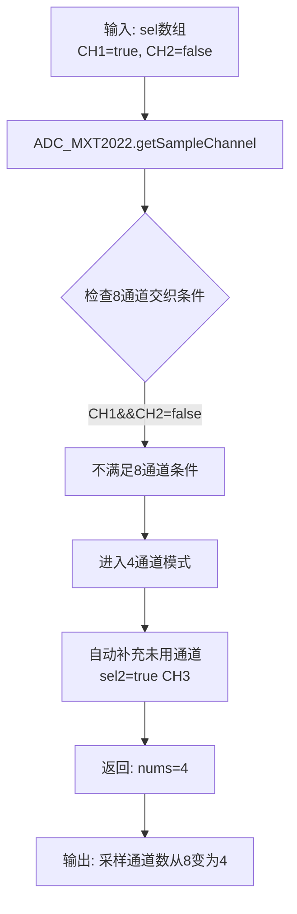
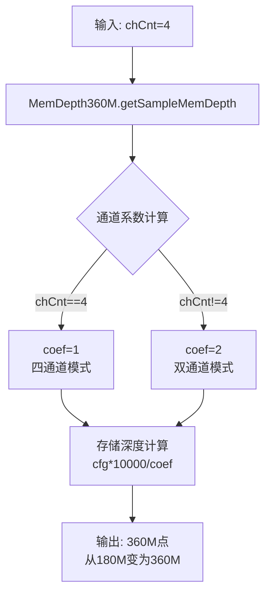
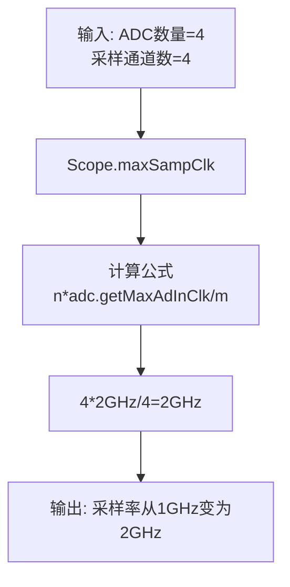
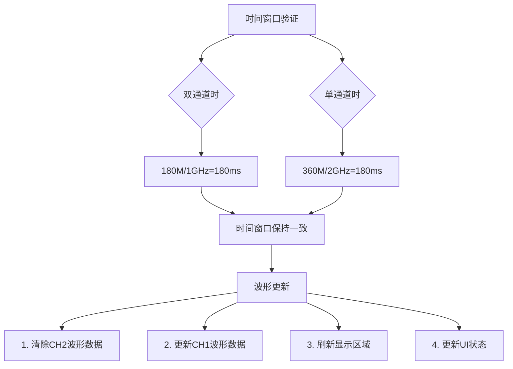
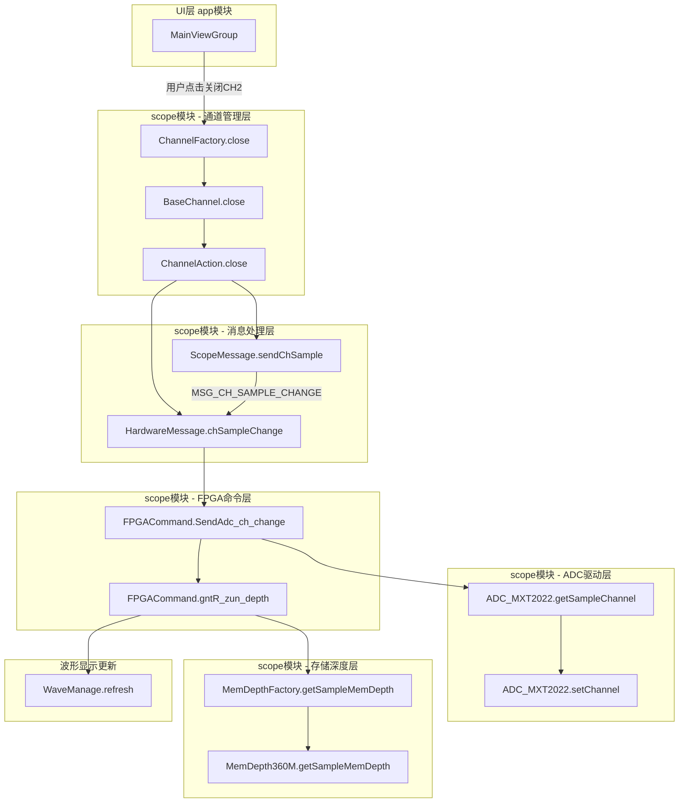
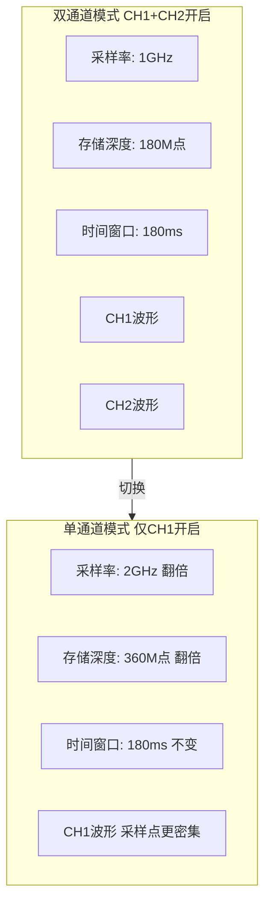

# 双通道采样切换到单通道采样完整流程分析

## 概述

本文档详细分析了MHO38示波器从双通道采样切换到单通道采样的完整流程，包括时序图、数据流程图、类调用图、关键代码和参数变化。

---

## 一、硬件架构背景

### 1.1 MHO38 ADC架构



### 1.2 关键参数

| 参数 | 值 | 说明 |
|------|-----|------|
| ADC芯片 | MXT2022 | 双通道ADC芯片 |
| ADC数量 | 4个 | 每个ADC支持2通道 |
| ADC最大采样率 | 2GHz | 单通道模式 |
| 存储深度 | 360M | MHO38型号 |

---

## 二、时序图



---

## 三、核心代码详解

### 3.1 步骤1：ChannelFactory.close() - 关闭通道入口

**文件位置**：`scope/src/main/java/com/micsig/tbook/scope/channel/ChannelFactory.java`

```java
public void close(int idx) {
    IChannel channel = getChannel(idx);
    if (channel != null) {
        if(!channel.isOpen()) return;      // 如果通道已经关闭，直接返回
        toBottomLayer(channel);             // 将通道移到底层（Z顺序）
        channel.close();                    // 调用通道的close方法
        boolean bActive = false;
        if(channelList.get(0).isOpen() ){   // 检查第一个通道是否开启
            if(!isSerialCh(channelList.get(0).getChId())) {
                channelList.get(0).activate();  // 激活第一个开启的通道
                bActive = true;
            }
        } else {
            toTopLayer(channel);            // 如果没有开启的通道，将当前通道移到顶层
        }
        if(!bActive){
            EventFactory.sendEvent(EventFactory.EVENT_CHANNEL_ACTIVE);  // 发送通道激活事件
        }
    }
}
```

**关键逻辑**：
1. 检查通道是否已经关闭
2. 将通道移到底层（Z顺序管理）
3. 调用通道的close方法
4. 激活其他开启的通道
5. 发送通道激活事件

---

### 3.2 步骤2：ChannelAction.close() - 通道动作处理

**文件位置**：`scope/src/main/java/com/micsig/tbook/scope/channel/ChannelAction.java`

```java
public void close(){
    sendChSample();                                    // 发送通道采样变化消息
    closeSample();                                     // 关闭采样
    sendEvent(EventFactory.EVENT_CHANNEL_CLOSE,true);  // 发送通道关闭事件
}

public void closeSample(){
    sendHwMsg(HardwareMessage.HARD_ID_CH_vSCALE_CH1);  // 发送硬件消息
    ChannelChange();                                   // 触发通道变化处理
}

private void ChannelChange(){
    sendFpgaMsg(FPGAMessage.FPGA_CMD_DIS_MODE
            | FPGAMessage.FPGA_CMD_Y_PLACE
            | FPGAMessage.FPGA_CMD_CH_OFFSET
            | FPGAMessage.FPGA_CMD_SAMP_MODE
            | FPGAMessage.FPGA_CMD_COUY
            | FPGAMessage.FPGA_CMD_DIS_PIX
            | FPGAMessage.FPGA_CMD_AD_CH_CHANGE      // ★ ADC通道切换命令
            | FPGAMessage.FPGA_CMD_SAMP_ZUN_DEPTH    // ★ 存储深度命令
            | FPGAMessage.FPGA_CMD_SAMP_PLACE
            | FPGAMessage.FPGA_CMD_DIS
            | FPGAMessage.FPGA_CMD_TRIG_LEVEL
            | FPGAMessage.FPGA_CMD_TRIG
    );
}
```

**关键FPGA命令**：
| 命令 | 说明 |
|------|------|
| FPGA_CMD_AD_CH_CHANGE | ADC通道切换 |
| FPGA_CMD_SAMP_ZUN_DEPTH | 存储深度配置 |
| FPGA_CMD_SAMP_MODE | 采样模式配置 |

---

### 3.3 步骤3：HardwareMessage.chSampleChange() - 硬件消息处理

**文件位置**：`scope/src/main/java/com/micsig/tbook/scope/Action/HardwareMessage.java`

```java
public void chSampleChange(){
    Scope scope = Scope.getInstance();

    boolean[] bSampleChange = {false};
    ChannelFactory.forEachCh(channel -> {
        if(scope.isChannelInSample(channel.getChId())){  // 检查通道是否在采样列表中
            if(!channel.isSample()){
                channel.setSample(true);     // 设置采样标志为true
                bSampleChange[0] = true;
            }
        }else {
            if(channel.isSample()){
                channel.setSample(false);    // 设置采样标志为false
                bSampleChange[0] = true;
            }
        }
        channel.setNeedWave(true);           // 标记通道需要波形数据
    });
    
    if(bSampleChange[0]) {
        if (Display.getInstance().isZoom()) {
            Display.getInstance().zoomChange();  // 触发缩放变化处理
        }
    }
}
```

**关键逻辑**：
1. 遍历所有通道
2. 更新通道的采样标志
3. 标记通道需要波形数据
4. 处理缩放模式更新

---

### 3.4 步骤4：FPGACommand.SendAdc_ch_change() - ADC通道切换

**文件位置**：`scope/src/main/java/com/micsig/tbook/scope/fpga/FPGACommand.java`

```java
public boolean SendAdc_ch_change(int fpgaIdx) {
    if(!scope.isRun()){
        return false;
    }

    boolean[] sle = new boolean[ChannelFactory.CH_CNT];
    int cnt = scope.getChannelSampOnCnt(scope.isRun(true), sle);  // 获取采样通道数

    boolean bChange = false;
    for (int i = 0; i < sle.length; i++) {
        if (sampleChState[i] != sle[i]) {    // 检测通道状态变化
            bChange = true;
            break;
        }
    }
    System.arraycopy(sle, 0, sampleChState, 0, sle.length);
    
    if (bChange) {
        ChannelHardw channelHardw = ChannelHardw.getInstance();
        if(adc.isChChangeReset()) {
            // 需要通道切换复位的情况
            for (int i = 0; i < fpgaNums; i++) {
                cmdFpgaPause(i);          // 暂停FPGA
                resetChOffset(i);         // 复位通道偏移
            }
            channelHardw.ChPowerEnable(false);   // 关闭通道电源
            ms_sleep(10);
            adc.setChannel(cnt, sle);             // ★ 设置ADC通道
            channelHardw.ChPowerEnable(true);    // 打开通道电源
            channelHardw.wrte_ad_gain(1);
            channelHardw.wrte_ad_gain(0);
            adc.setCalibrate();
            channelHardw.changeChVolScale();
            for (int i = 0; i < fpgaNums; i++) {
                gntR_ChOffsetDa(i);
            }
            cmdDevice(100);
            cmdFpgaResume(1);
            cmdFpgaResume(0);
        }else {
            // 不需要复位的情况
            adc.setChannel(cnt, sle);             // ★ 设置ADC通道
            channelHardw.wrte_ad_gain(fpgaIdx);
            adc.setCalibrate();
        }
        cmdChNoise(fpgaIdx);
    }
    return bChange;
}
```

**关键流程**：
1. 获取当前采样通道数
2. 检测通道状态变化
3. 暂停FPGA（如需要复位）
4. 设置ADC通道配置
5. 恢复FPGA

---

### 3.5 步骤5：ADC_MXT2022.getSampleChannel() - 采样通道计算

**文件位置**：`scope/src/main/java/com/micsig/tbook/scope/Calibrate/ADC_MXT2022.java`

```java
@Override
public int getSampleChannel(boolean[] sel) {
    int nums = 0;
    
    // 检查是否需要8通道交织模式
    // 条件：任意ADC的两个通道同时启用
    if ((sel[0] && sel[1])        // ADC1: CH1和CH2同时启用
            || (sel[2] && sel[3]) // ADC2: CH3和CH4同时启用
            || (sel[4] && sel[5]) // ADC3: CH5和CH6同时启用
            || (sel[6] && sel[7]) // ADC4: CH7和CH8同时启用
    ) {
        // 8通道模式：启用所有通道
        Arrays.fill(sel, true);
        nums = 8;
    } else {
        // 4通道模式：补充未使用的通道
        for (int i = 0; i < sel.length; i += 2) {
            if ((!sel[i]) && (!sel[i + 1])) {
                sel[i] = true;  // 自动启用奇数通道
            }
        }
        nums = 4;
    }

    return nums;
}
```

**模式判断逻辑**：

| 条件 | 结果 | 说明 |
|------|------|------|
| CH1和CH2同时开启 | nums=8 | 8通道交织模式 |
| CH1开启，CH2关闭 | nums=4 | 4通道模式，自动补充CH3 |
| 仅CH1开启 | nums=4 | 4通道模式 |

---

### 3.6 步骤6：MemDepth360M.getSampleMemDepth() - 存储深度计算

**文件位置**：`scope/src/main/java/com/micsig/tbook/scope/Sample/MemDepth360M.java`

```java
@Override
public int getSampleMemDepth(int chCnt) {
    SegmentSample segmentSample = SegmentSample.getInstance();
    
    // 基准值：36000（用于计算各档位）
    int cfg = 36000;

    // 通道系数计算（特殊逻辑）
    int coef = 1;
    if (chCnt == 4) {
        coef = 1;   // 四通道模式：系数为1
    } else {
        coef = 2;   // 双通道模式：系数为2
    }
    
    // 根据档位索引计算存储深度
    switch (getMemDepthItem()) {
        case 1:
            return cfg * 1000 * 10 / coef;  // 360M 或 180M
        case 2:
            return cfg * 1000 / coef;       // 36M 或 18M
        case 3:
            return cfg * 100 / coef;        // 3.6M 或 1.8M
        case 4:
            return cfg * 10 / coef;         // 360K 或 180K
        case 5:
            return cfg * 1 / coef;          // 36K 或 18K
        default:
        case 0:
            int a = getAuto(cfg, coef);
            if (segmentSample.isSegmentEnable()) {
                int s = getSegment(cfg, coef);
                if (s > a) {
                    s = a;
                }
                return s;
            }
            return a;
    }
}
```

**存储深度计算表**：

| 档位 | 四通道模式 (coef=1) | 双通道模式 (coef=2) |
|------|---------------------|---------------------|
| 1 | 360M点 | 180M点 |
| 2 | 36M点 | 18M点 |
| 3 | 3.6M点 | 1.8M点 |
| 4 | 360K点 | 180K点 |
| 5 | 36K点 | 18K点 |

---

### 3.7 步骤7：Scope.maxSampClk() - 采样率计算

**文件位置**：`scope/src/main/java/com/micsig/tbook/scope/Scope.java`

```java
public long maxSampClk(){
    long n = HwConfig.getInstance().getAdcNums();  // ADC数量 = 4
    long m = getChannelSampOnCnt();                 // 采样通道数
    if(m < n){
        m = n;
    }
    return n * adc.getMaxAdInClk() / m;             // 计算采样率
    // 双通道模式：4 * 2GHz / 8 = 1GHz
    // 单通道模式：4 * 2GHz / 4 = 2GHz
}
```

**采样率计算示例**：

| 模式 | ADC数量 | 采样通道数 | 采样率计算 |
|------|---------|-----------|-----------|
| 双通道(CH1+CH2) | 4 | 8 | 4 × 2GHz / 8 = 1GHz |
| 单通道(CH1) | 4 | 4 | 4 × 2GHz / 4 = 2GHz |

---

## 四、数据流程图

### 4.1 阶段1：事件触发



### 4.2 阶段2：ADC通道切换



### 4.3 阶段3：存储深度计算



### 4.4 阶段4：采样率计算



### 4.5 阶段5：波形显示更新



---

## 五、类调用图



---

## 六、关键参数变化表

| 参数 | 双通道模式 (CH1+CH2) | 单通道模式 (CH1) | 变化 |
|------|----------------------|------------------|------|
| 采样通道数 | 8 (交织模式) | 4 | 减少50% |
| 采样率 | 1GHz (4×2GHz÷8) | 2GHz (4×2GHz÷4) | 增加100% |
| 存储深度 | 180M点 (360M÷2) | 360M点 (360M÷1) | 增加100% |
| 时间窗口 | 180ms (180M÷1GHz) | 180ms (360M÷2GHz) | **保持不变** |
| ADC模式 | 8通道交织 | 4通道模式 | 模式切换 |
| 通道系数 | 2 | 1 | 减半 |

---

## 七、波形显示一致性保证

### 7.1 核心公式

```
时间窗口 = 存储深度 ÷ 采样率 = 常数

双通道：180M ÷ 1GHz = 180ms
单通道：360M ÷ 2GHz = 180ms
```

### 7.2 设计原理

虽然采样率和存储深度都变化了，但时间窗口保持一致，因此界面显示的波形时间跨度相同。



---

## 八、核心代码路径总结

| 步骤 | 类 | 方法 | 功能 | 文件位置 |
|------|-----|------|------|---------|
| 1 | ChannelFactory | close(idx) | 关闭通道入口 | channel/ChannelFactory.java:326 |
| 2 | BaseChannel | close() | 设置通道关闭状态 | channel/BaseChannel.java |
| 3 | ChannelAction | close() | 发送采样变化消息 | channel/ChannelAction.java:152 |
| 4 | ScopeMessage | sendChSample() | 发送MSG_CH_SAMPLE_CHANGE | ScopeMessage.java:516 |
| 5 | HardwareMessage | chSampleChange() | 处理通道采样变化 | Action/HardwareMessage.java:246 |
| 6 | FPGACommand | SendAdc_ch_change() | 发送ADC通道切换命令 | fpga/FPGACommand.java:3949 |
| 7 | ADC_MXT2022 | getSampleChannel() | 计算采样通道数（8→4） | Calibrate/ADC_MXT2022.java:314 |
| 8 | ADC_MXT2022 | setChannel() | 配置ADC交织模式 | Calibrate/ADC_MXT2022.java |
| 9 | FPGACommand | gntR_zun_depth() | 发送存储深度命令 | fpga/FPGACommand.java |
| 10 | MemDepth360M | getSampleMemDepth() | 计算存储深度（180M→360M） | Sample/MemDepth360M.java:169 |
| 11 | Scope | maxSampClk() | 计算采样率（1GHz→2GHz） | Scope.java:963 |
| 12 | WaveManage | refresh() | 刷新波形显示 | wavezone/wave/WaveManage.java |

---

## 九、相关源码文件

| 文件路径 | 功能 |
|---------|------|
| scope/src/main/java/com/micsig/tbook/scope/channel/ChannelFactory.java | 通道工厂，管理通道开关 |
| scope/src/main/java/com/micsig/tbook/scope/channel/BaseChannel.java | 通道基类 |
| scope/src/main/java/com/micsig/tbook/scope/channel/ChannelAction.java | 通道动作处理器 |
| scope/src/main/java/com/micsig/tbook/scope/ScopeMessage.java | 示波器消息处理 |
| scope/src/main/java/com/micsig/tbook/scope/Action/HardwareMessage.java | 硬件消息处理 |
| scope/src/main/java/com/micsig/tbook/scope/fpga/FPGACommand.java | FPGA命令发送 |
| scope/src/main/java/com/micsig/tbook/scope/Calibrate/ADC_MXT2022.java | ADC驱动 |
| scope/src/main/java/com/micsig/tbook/scope/Sample/MemDepth360M.java | 存储深度计算 |
| scope/src/main/java/com/micsig/tbook/scope/Scope.java | 示波器核心 |

---

## 十、总结

本文档详细分析了MHO38示波器从双通道采样切换到单通道采样的完整流程，包括：

1. **时序图**：展示了从用户操作到波形显示的完整时序
2. **核心代码详解**：展示了每个关键步骤的具体代码实现
3. **数据流程图**：展示了各阶段的数据处理过程
4. **类调用图**：展示了模块间的调用关系
5. **参数变化表**：展示了关键参数的变化情况

**核心结论**：通过存储深度和采样率的联动调整，保证了波形显示的时间窗口一致性，用户在切换通道时不会感觉到波形时间跨度的变化。

---

## 十一、Draw.io使用说明

### 如何在Draw.io中插入Mermaid图表

1. 打开Draw.io
2. 点击菜单 **Arrange** → **Insert** → **Advanced** → **Mermaid**
3. 将文档中的Mermaid代码复制粘贴到弹出的对话框中
4. 点击 **Insert** 即可生成图表

### 支持的图表类型

- `graph TB` / `graph TD` - 流程图（从上到下）
- `sequenceDiagram` - 时序图
- `flowchart TD` - 流程图
- `classDiagram` - 类图
- `stateDiagram` - 状态图
