# 示波器硬件控制与校准系统分析

## 目录

1. [垂直档位调整时继电器控制流程](#一垂直档位调整时继电器控制流程)
   - [1.1 整体架构](#11-整体架构)
   - [1.2 触发方式概览](#12-触发方式概览)
   - [1.3 UI触摸按钮触发流程](#13-ui触摸按钮触发流程)
   - [1.4 物理按键控制档位调整流程](#14-物理按键控制档位调整流程)
   - [1.5 公共处理流程](#15-公共处理流程)
2. [档位与继电器状态对应关系](#二档位与继电器状态对应关系)
3. [移位寄存器位定义](#三移位寄存器位定义)
4. [单通道控制字结构](#四单通道控制字结构)
5. [Calibrate包完整分析](#五calibrate包完整分析)
6. [通道阻抗切换消息流程](#六通道阻抗切换消息流程)
7. [波形功能完整分析](#七波形功能完整分析)
8. [SPI扩展总线功能分析](#八spi扩展总线功能分析)

***

## 一、垂直档位调整时继电器控制流程

### 1.1 整体架构

```
用户操作(UI层/物理按键) → 业务逻辑层 → 硬件抽象层 → 硬件驱动层 → 物理硬件(继电器)
```

### 1.2 触发方式概览

垂直档位调整有两种触发方式：

| 触发方式        | 入口文件                          | 消息类型                              | 适用场景      |
| ----------- | ----------------------------- | --------------------------------- | --------- |
| **UI触摸按钮**  | MainChannelVerticalScale.java | MQ\_MSG\_CHANNEL\_VERTICAL\_SCALE | 触摸屏点击     |
| **物理旋钮/按键** | ExternalKeysProtocol.java     | EXTERNALKEYS\_VSCALE              | 物理旋钮旋转/按键 |

### 1.3 UI触摸按钮触发流程

#### 入口文件: MainChannelVerticalScale.java

当用户点击上/下按钮调整垂直档位时：

```java
// L106-L122: 点击按钮后发送消息
private void postChange(boolean isClickTop) {
    // 发送RxBus消息，通知档位变化
    RxBus.getInstance().post(RxEnum.MQ_MSG_CHANNEL_VERTICAL_SCALE, isClickTop + CommandMsgToUI.PARAM_SPLIT + channelNumber);
}
```

### 1.4 物理按键控制档位调整流程

#### 1.4.1 物理按键类型定义

**文件**: `ExternalKeysProtocol.java`

```java
// 按键类型定义
public final static byte TYPE_KEY_PRESS = 0x01;        // 按键按下
public final static byte TYPE_KEY_PRESS_LONG = 0x03;   // 按键长按
public final static byte TYPE_KNOB = 0x0E;             // 编码器(旋钮)

// 旋钮方向定义
public final static byte KNOB_CLOCKWISE = 0;           // 顺时针
public final static byte KNOB_ANTICLOCKWISE = 1;       // 逆时针

// 旋钮功能定义
public final static byte KNOB_VERTICAL_SCALE = 6;      // 垂直档位旋钮
public final static byte KNOB_VERTICAL_POSITION = 5;   // 垂直位置旋钮
public final static byte KNOB_HORIZONTAL_SCALE = 4;    // 水平档位旋钮
public final static byte KNOB_TRIGGER_LEVEL = 3;       // 触发电平旋钮

// 按键定义
private final static byte KEY_15_SCALE_DOWN = ...;     // 档位减小按键
private final static byte KEY_45_SCALE_UP = ...;       // 档位增大按键
```

#### 1.4.2 物理按键处理流程图

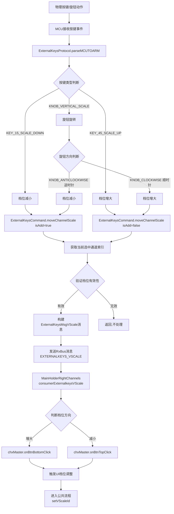
```mermaid
flowchart TD
    A[物理按键/旋钮动作] --> B[MCU接收按键事件]
    B --> C[ExternalKeysProtocol.parseMCUTOARM]
    
    C --> D{按键类型判断}
    D -->|KEY_15_SCALE_DOWN| E[档位减小]
    D -->|KEY_45_SCALE_UP| F[档位增大]
    D -->|KNOB_VERTICAL_SCALE| G[旋钮旋转]
    
    E --> H[ExternalKeysCommand.moveChannelScale<br/>isAdd=true]
    F --> I[ExternalKeysCommand.moveChannelScale<br/>isAdd=false]
    G --> J{旋钮方向判断}
    J -->|KNOB_CLOCKWISE 顺时针| K[档位增大]
    J -->|KNOB_ANTICLOCKWISE 逆时针| L[档位减小]
    
    K --> I
    L --> H
    
    H --> M[获取当前选中通道索引]
    I --> M
    
    M --> N{验证档位有效性}
    N -->|有效| O[构建ExternalKeysMsgVScale消息]
    N -->|无效| P[返回,不处理]
    
    O --> Q[发送RxBus消息<br/>EXTERNALKEYS_VSCALE]
    Q --> R[MainHolderRightChannels<br/>consumerExternalkeysVScale]
    
    R --> S{判断档位方向}
    S -->|增大| T[chxMaster.onBtnBottomClick]
    S -->|减小| U[chxMaster.onBtnTopClick]
    
    T --> V[触发UI档位调整]
    U --> V
    
    V --> W[进入公共流程<br/>setVScaleId]
```

#### 1.4.3 ExternalKeysProtocol处理物理按键

**文件**: `ExternalKeysProtocol.java`

```java
// 处理按键按下事件 - 档位减小
case KEY_15_SCALE_DOWN:
    if (ExternalKeysCommand.get().isSerialsWordVisible()) {
        break;
    }
    Log.d("handler", "调整------1-------------------scale delay");
    // 调用档位调整方法，isAdd=true表示增大档位值(减小灵敏度)
    ExternalKeysCommand.get().moveChannelScale(true, state == TYPE_KEY_PRESS ? 1 : getPressLongSpeed(4));
    break;

// 处理按键按下事件 - 档位增大
case KEY_45_SCALE_UP:
    if (ExternalKeysCommand.get().isSerialsWordVisible()) {
        break;
    }
    Log.d("handler", "调整------------2-------------scale delay");
    // 调用档位调整方法，isAdd=false表示减小档位值(增大灵敏度)
    ExternalKeysCommand.get().moveChannelScale(false, state == TYPE_KEY_PRESS ? 1 : getPressLongSpeed(4));
    break;

// 处理旋钮旋转事件 - 垂直档位旋钮
case KNOB_VERTICAL_SCALE:
    if (ExternalKeysCommand.get().isSerialsWordVisible()) {
        break;
    }
    Log.d("handler", "调整-----------3--------------scale delay");
    // dir: KNOB_CLOCKWISE=顺时针, KNOB_ANTICLOCKWISE=逆时针
    // val: 旋转步数
    ExternalKeysCommand.get().moveChannelScale(dir == KNOB_CLOCKWISE, val);
    break;
```

#### 1.4.4 ExternalKeysCommand处理档位调整

**文件**: `ExternalKeysCommand.java`

```java
private ExternalKeysMsgVScale msgVScale = new ExternalKeysMsgVScale();

public void moveChannelScale(boolean isAdd, int count) {
    Log.d("TAG", "调整-------------------------m" + isAdd + "c" + count);

    // 获取通道选择组件
    if (channels == null) {
        channels = (MainLayoutCenterChannel) mainViewGroup.findViewById(R.id.mainLayoutCenterChannels);
    }

    // 获取当前选中的通道索引
    int index = channels.getChannelSelectIndex();
    if (index == -1) return;

    // 获取通道对象
    Channel channel = ChannelFactory.getDynamicChannel(index);
    if (channel != null) {
        // 验证档位是否在有效范围内
        double v = channel.getVScaleVal() / channel.getProbeRate();
        if (isAdd && v >= VerticalAxis.getScaleIdValById(channel.getMaxGear())) {
            return;  // 已达到最大档位
        } else if (!isAdd && v <= VerticalAxis.getScaleIdValById(channel.getMinGear())) {
            return;  // 已达到最小档位
        }
    }

    // 构建消息
    msgVScale.setChIndex(index);
    msgVScale.setAdd(isAdd);
    msgVScale.setCount(count);
    
    // 发送RxBus消息
    RxBus.getInstance().post(RxEnum.EXTERNALKEYS_VSCALE, msgVScale);
    
    // 打开右侧滑出菜单
    if (TChan.isChan(TChan.toUiChNo(index))) {
        RxBus.getInstance().post(RxEnum.SLIPRIGHTMENU, MainHolderBottom.SLIPRIGHTMENU_CHANNELS);
    } else if (TChan.isMathToR8(TChan.toUiChNo(index))) {
        RxBus.getInstance().post(RxEnum.SLIPRIGHTMENU, MainHolderBottom.SLIPRIGHTMENU_OTHERS);
    }
    
    // 光标跟踪
    if (ChannelFactory.isChActivate(index)) {
        CursorManage.getInstance().setCursorTrace(true);
        CursorManage.getInstance().curChannelMove();
        CursorManage.getInstance().setCursorTrace(false);
    }
}
```

#### 1.4.5 MainHolderRightChannels接收消息

**文件**: `MainHolderRightChannels.java`

```java
private Consumer<ExternalKeysMsgVScale> consumerExternalkeysVScale = new Consumer<ExternalKeysMsgVScale>() {
    @Override
    public void accept(ExternalKeysMsgVScale msgVScale) throws Exception {
        // 判断是否为有效通道
        if (TChan.isChan(TChan.toUiChNo(msgVScale.getChIndex()))) {
            Log.d("TAG", "调整-----------------------MainHolderRightChannels.accept: " + msgVScale.getChIndex());
            
            // 根据方向调用不同的按钮点击方法
            if (msgVScale.isAdd()) {
                // 档位增大(灵敏度降低)
                chxMasters.get(msgVScale.getChIndex()).onBtnBottomClick();
            } else {
                // 档位减小(灵敏度提高)
                chxMasters.get(msgVScale.getChIndex()).onBtnTopClick();
            }
        }
    }
};
```

#### 1.4.6 物理按键时序图

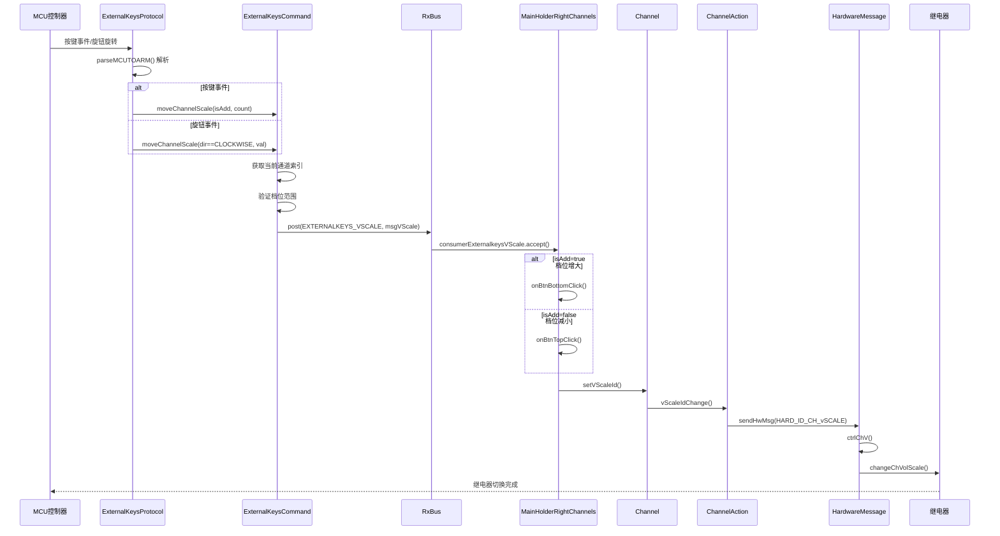
```mermaid
sequenceDiagram
    participant MCU as MCU控制器
    participant EKP as ExternalKeysProtocol
    participant EKC as ExternalKeysCommand
    participant RxBus as RxBus
    participant MHR as MainHolderRightChannels
    participant CH as Channel
    participant CA as ChannelAction
    participant HW as HardwareMessage
    participant Relay as 继电器
    
    MCU->>EKP: 按键事件/旋钮旋转
    EKP->>EKP: parseMCUTOARM() 解析
    
    alt 按键事件
        EKP->>EKC: moveChannelScale(isAdd, count)
    else 旋钮事件
        EKP->>EKC: moveChannelScale(dir==CLOCKWISE, val)
    end
    
    EKC->>EKC: 获取当前通道索引
    EKC->>EKC: 验证档位范围
    EKC->>RxBus: post(EXTERNALKEYS_VSCALE, msgVScale)
    
    RxBus->>MHR: consumerExternalkeysVScale.accept()
    
    alt isAdd=true 档位增大
        MHR->>MHR: onBtnBottomClick()
    else isAdd=false 档位减小
        MHR->>MHR: onBtnTopClick()
    end
    
    MHR->>CH: setVScaleId()
    CH->>CA: vScaleIdChange()
    CA->>HW: sendHwMsg(HARD_ID_CH_vSCALE)
    HW->>HW: ctrlChV()
    HW->>Relay: changeChVolScale()
    
    Relay-->>MCU: 继电器切换完成
```

#### 1.4.7 按键与旋钮对照表

| 物理按键       | 按键码                                         | 功能      | 档位变化  |
| ---------- | ------------------------------------------- | ------- | ----- |
| Scale Down | KEY\_15\_SCALE\_DOWN                        | 档位减小按键  | 灵敏度提高 |
| Scale Up   | KEY\_45\_SCALE\_UP                          | 档位增大按键  | 灵敏度降低 |
| 垂直档位旋钮顺时针  | KNOB\_VERTICAL\_SCALE + KNOB\_CLOCKWISE     | 旋钮顺时针旋转 | 灵敏度降低 |
| 垂直档位旋钮逆时针  | KNOB\_VERTICAL\_SCALE + KNOB\_ANTICLOCKWISE | 旋钮逆时针旋转 | 灵敏度提高 |

### 1.5 公共处理流程

#### 业务逻辑层处理

**文件**: `RightLayoutChannel.java`

接收消息并处理：

```java
// L1096-L1114: 接收垂直档位调整消息
private Consumer<String> consumerChannelVscale = new Consumer<String>() {
    @Override
    public void accept(String adjustStr) throws Throwable {
        // 解析参数，判断是向上还是向下调整
        boolean isClickTop = Boolean.parseBoolean(param[0]);
        // 调用postChange()进行档位切换
        postChange();
        // 发送消息到消息队列
        RxBus.getInstance().post(RxEnum.MQ_MSG_CHANNEL_CHX, msgChannel);
    }
};
```

#### 3. 通道层处理

**文件**: `Channel.java`

设置新的档位ID：

```java
// L481-L513: 设置垂直档位ID
private void setVScaleId(int scaleId, double fine, boolean bUser, boolean initScaleBak) {
    // 验证档位有效性
    if (VerticalAxis.isValidScaleId(scaleId) && isVScaleIdValid(scaleId)) {
        // 设置档位
        verticalAxis.setScaleId(scaleId);
        // 触发档位变化动作 - 这里会触发继电器控制
        channelAction.vScaleIdChange();
    }
}
```

#### 4. 通道动作层

**文件**: `ChannelAction.java`

触发硬件消息：

```java
// L160-L176: 档位变化时发送硬件消息
public void vScaleChange() {
    int idx = channel.getChId();
    // 发送硬件消息 - 触发继电器控制
    sendHwMsg(HardwareMessage.HARD_ID_CH_vSCALE_CH1 << (idx));
    // 发送FPGA消息
    sendFpgaMsg(...);
}

// L191-L196: 档位ID变化
public void vScaleIdChange() {
    vScaleChange();  // 触发继电器控制
    sendEvent(EventFactory.EVENT_CHANNEL_VSCALE);
    // ...
}
```

#### 5. 硬件消息处理层

**文件**: `HardwareMessage.java`

处理硬件命令：

```java
// L131-L148: 运行硬件命令
public void run() {
    // 检查是否有垂直档位变化命令
    if (isMask(cmd & (HARD_ID_CH_vSCALE_MASK))) {
        ctrlChV();  // 控制通道垂直档位（包含继电器控制）
    }
}

// L161-L178: 控制通道垂直档位
private void ctrlChV() {
    ChannelHardw hardw = ChannelHardw.getInstance();
    FPGACommand cmd = FPGACommand.getInstance();
    
    // 关键：调用硬件控制改变垂直档位（继电器控制）
    hardw.changeChVolScale();  // ← 这里控制继电器
    
    // 设置PGA增益
    hardw.ctrlAD8370Gain();
    
    // 更新FPGA寄存器
    for(int i=0; i<fpgaNums; i++) {
        hardw.wrte_ad_gain(i);
        cmd.updateChCapacitance(i);
        // ...
    }
}
```

#### 6. 硬件抽象层 (继电器控制核心)

**文件**: `HW_MHO68V2.java`

**这是继电器控制的核心代码**：

```java
// L126-L191: 改变通道垂直档位 - 控制继电器
@Override
public void changeChVolScale() {
    if(!bPowerEnable) return;
    
    long marsk = SHIFTREG_INIT_VAL_MHO10008;  // 移位寄存器初始值
    
    // 遍历所有通道
    for(int ch = ChannelFactory.CH1; ch < chMax; ch++) {
        idx = ChannelFactory.CH8 - ch;
        channel = ChannelFactory.getDynamicChannel(ch);
        resistanceType = channel.getResistanceType();
        
        // 根据当前档位值计算继电器档位索引
        dang = getRatioIdx(resistanceType, channel.getVScaleVal() / channel.getProbeRate());
        
        // 根据档位设置继电器控制位
        switch (dang) {
            case HW.RATIO_DANG_1:  // 第一档
                pdVal |= (0x6L << ((ch * 8)));
                break;
            case HW.RATIO_DANG_2:  // 第二档
                pdVal |= (0xDL << ((ch * 8)));
                break;
            case HW.RATIO_DANG_3:  // 第三档
                pdVal |= (0xBL << ((ch * 8)));
                break;
        }
        
        // 根据阻抗类型(1MΩ/50Ω)设置不同的继电器控制位
        if(resistanceType == Channel.RESISTANCE_50) {
            // 50Ω阻抗的继电器控制
            marsk &= ~(1L << (idx * 8 + 3));
            marsk &= ~(1L << (idx * 8 + 4));
            // ...
        } else {
            // 1MΩ阻抗的继电器控制
            marsk &= ~(1L << (idx * 8 + 2));
            // ...
        }
    }
    
    // 发送移位寄存器命令 - 控制继电器动作
    sendShiftRegister(temp & marsk);  // 第一次发送
    usleep(3000);                      // 延时3ms
    sendShiftRegister(temp);           // 第二次发送（确认）
    
    // 发送PD值到FPGA
    FPGACommand.getInstance().SendChPD_v2(pdVal);
}
```

**文件**: `HW.java`

发送移位寄存器命令：

```java
// L34-L36: 发送移位寄存器命令（控制继电器）
public void sendShiftRegister(long val) {
    Hardware.getInstance().sendShiftRegister(val, 64);
}
```

### 1.3 流程图

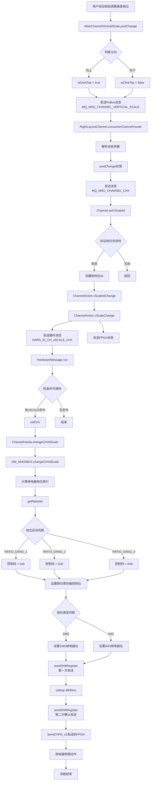
```mermaid
flowchart TD
    A[用户扭动按钮调整垂直档位] --> B[MainChannelVerticalScale.postChange]
    B --> C{判断方向}
    C -->|向上| D[isClickTop = true]
    C -->|向下| E[isClickTop = false]
    D --> F[发送RxBus消息<br/>MQ_MSG_CHANNEL_VERTICAL_SCALE]
    E --> F
    
    F --> G[RightLayoutChannel.consumerChannelVscale]
    G --> H[解析消息参数]
    H --> I[postChange处理]
    I --> J[发送消息<br/>MQ_MSG_CHANNEL_CHX]
    
    J --> K[Channel.setVScaleId]
    K --> L{验证档位有效性}
    L -->|有效| M[设置新档位ID]
    L -->|无效| N[返回]
    M --> O[ChannelAction.vScaleIdChange]
    
    O --> P[ChannelAction.vScaleChange]
    P --> Q[发送硬件消息<br/>HARD_ID_CH_vSCALE_CH1]
    P --> R[发送FPGA消息]
    
    Q --> S[HardwareMessage.run]
    S --> T{检查命令掩码}
    T -->|有vSCALE命令| U[ctrlChV]
    T -->|无命令| V[结束]
    
    U --> W[ChannelHardw.changeChVolScale]
    W --> X[HW_MHO68V2.changeChVolScale]
    
    X --> Y[计算继电器档位索引]
    Y --> Z[getRatioIdx]
    Z --> AA{档位区间判断}
    
    AA -->|RATIO_DANG_1| AB[控制码 = 0x6]
    AA -->|RATIO_DANG_2| AC[控制码 = 0xD]
    AA -->|RATIO_DANG_3| AD[控制码 = 0xB]
    
    AB --> AE[设置移位寄存器控制位]
    AC --> AE
    AD --> AE
    
    AE --> AF{阻抗类型判断}
    AF -->|1MΩ| AG[设置1MΩ继电器位]
    AF -->|50Ω| AH[设置50Ω继电器位]
    
    AG --> AI[sendShiftRegister<br/>第一次发送]
    AH --> AI
    
    AI --> AJ[usleep 3000ms]
    AJ --> AK[sendShiftRegister<br/>第二次确认发送]
    AK --> AL[SendChPD_v2发送到FPGA]
    AL --> AM[继电器物理动作]
    AM --> AN[流程结束]
```

### 1.4 关键点总结

1. **继电器控制时机**：当垂直档位跨越不同档位区间时触发继电器切换
2. **继电器控制方式**：通过移位寄存器发送64位控制字
3. **延时要求**：继电器动作需要3ms延时后再次确认
4. **阻抗影响**：1MΩ和50Ω阻抗使用不同的继电器控制逻辑
5. **档位区间**：系统将15个垂直档位划分为3个继电器档位区间

***

## 二、档位与继电器状态对应关系

### 2.1 档位分组定义

根据 `HW_MHO68V2.java` 中的定义：

```java
// 档位区间阈值定义
public static double [] RATIO_DANG_VAL = {0.025, 0.6, 10};      // 1MΩ阻抗
public static double [] RATIO_DANG_VAL_50 = {0.015, 0.1, 1};    // 50Ω阻抗

// 档位索引计算
public int getRatioIdx(int resistanceType, double v) {
    double [] ratioDangVal = resistanceType == 0 ? RATIO_DANG_VAL : RATIO_DANG_VAL_50;
    for(int i=0; i<ratioDangVal.length; i++) {
        if(v <= ratioDangVal[i]) break;
    }
    return i;
}
```

### 2.2 档位分组详细对照表

#### 1MΩ阻抗档位分组

| 继电器档位              | 代码名称 | 档位值范围(V/div)  | 包含的具体档位                                 | 衰减比   | 信号处理路径  |
| ------------------ | ---- | ------------- | --------------------------------------- | ----- | ------- |
| **RATIO\_DANG\_1** | 第一档  | ≤25mV         | 250μV, 500μV, 1mV, 2mV, 5mV, 10mV, 20mV | 1:1   | 高增益放大路径 |
| **RATIO\_DANG\_2** | 第二档  | 25mV \~ 600mV | 50mV, 100mV, 200mV, 500mV               | 1:10  | 中等衰减路径  |
| **RATIO\_DANG\_3** | 第三档  | ≥600mV        | 1V, 2V, 5V, 10V                         | 1:100 | 高衰减路径   |

#### 50Ω阻抗档位分组

| 继电器档位              | 代码名称 | 档位值范围(V/div)  | 包含的具体档位                           | 衰减比   | 信号处理路径  |
| ------------------ | ---- | ------------- | --------------------------------- | ----- | ------- |
| **RATIO\_DANG\_1** | 第一档  | ≤15mV         | 250μV, 500μV, 1mV, 2mV, 5mV, 10mV | 1:1   | 高增益放大路径 |
| **RATIO\_DANG\_2** | 第二档  | 15mV \~ 100mV | 20mV, 50mV, 100mV                 | 1:10  | 中等衰减路径  |
| **RATIO\_DANG\_3** | 第三档  | ≥100mV        | 200mV, 500mV, 1V (最大)             | 1:100 | 高衰减路径   |

### 2.3 继电器配置与信号处理流程

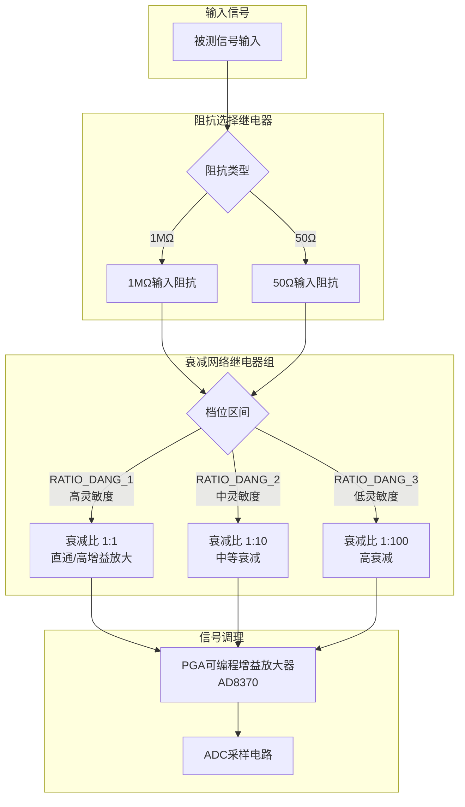
```mermaid
flowchart TB
    subgraph 输入信号
        A[被测信号输入]
    end
    
    subgraph 阻抗选择继电器
        B{阻抗类型}
        B -->|1MΩ| C[1MΩ输入阻抗]
        B -->|50Ω| D[50Ω输入阻抗]
    end
    
    subgraph 衰减网络继电器组
        E{档位区间}
        E -->|RATIO_DANG_1<br/>高灵敏度| F[衰减比 1:1<br/>直通/高增益放大]
        E -->|RATIO_DANG_2<br/>中灵敏度| G[衰减比 1:10<br/>中等衰减]
        E -->|RATIO_DANG_3<br/>低灵敏度| H[衰减比 1:100<br/>高衰减]
    end
    
    subgraph 信号调理
        I[PGA可编程增益放大器<br/>AD8370]
        J[ADC采样电路]
    end
    
    A --> B
    C --> E
    D --> E
    F --> I
    G --> I
    H --> I
    I --> J
```

### 2.4 档位切换时的信号处理变化

| 切换场景              | 继电器动作       | PGA增益调整 | ADC满量程调整 | 备注         |
| ----------------- | ----------- | ------- | -------- | ---------- |
| DANG\_1 → DANG\_2 | 衰减网络切换1:10  | 增益降低    | FS调整     | 信号幅度缩小10倍  |
| DANG\_2 → DANG\_3 | 衰减网络切换1:100 | 增益降低    | FS调整     | 信号幅度再缩小10倍 |
| DANG\_3 → DANG\_2 | 衰减网络切换1:10  | 增益提高    | FS调整     | 信号幅度放大10倍  |
| DANG\_2 → DANG\_1 | 衰减网络切换1:1   | 增益提高    | FS调整     | 信号幅度放大10倍  |
| 1MΩ → 50Ω         | 输入阻抗继电器切换   | 重新计算    | 重新计算     | 档位范围变化     |
| 50Ω → 1MΩ         | 输入阻抗继电器切换   | 重新计算    | 重新计算     | 档位范围变化     |

***

## 三、移位寄存器位定义

### 3.1 64位移位寄存器整体结构

```
初始值: SHIFTREG_INIT_VAL_MHO10008 = 0xFFFFFFFFFFFFFFFF (64位全1)

┌────────────────────────────────────────────────────────────────────────────────┐
│                           64位移位寄存器控制字                                   │
├────────┬────────┬────────┬────────┬────────┬────────┬────────┬────────┬────────┤
│ Bit 63 │ Bit 62 │ Bit 61 │ Bit 60 │ Bit 59 │ Bit 58 │ Bit 57 │ Bit 56 │ ...    │
│   ~    │   ~    │   ~    │   ~    │   ~    │   ~    │   ~    │   ~    │        │
│ Bit 56 │ Bit 57 │ Bit 58 │ Bit 59 │ Bit 60 │ Bit 61 │ Bit 62 │ Bit 63 │        │
├────────┴────────┴────────┴────────┴────────┴────────┴────────┴────────┤        │
│                        CH8 控制位 (8位)                                │        │
├────────────────────────────────────────────────────────────────────────┤        │
│                        CH7 控制位 (8位)                                │        │
├────────────────────────────────────────────────────────────────────────┤        │
│                              ...                                       │        │
├────────────────────────────────────────────────────────────────────────┤        │
│                        CH1 控制位 (8位)                                │        │
└────────────────────────────────────────────────────────────────────────┘

注意：通道索引 idx = CH8 - ch，即CH1在高位，CH8在低位
```

### 3.2 单通道8位控制字详细定义

```
单通道控制字结构 (8位)
═══════════════════════════════════════════════════════════════════════

  Bit 7    Bit 6    Bit 5    Bit 4    Bit 3    Bit 2    Bit 1    Bit 0
┌────────┬────────┬────────┬────────┬────────┬────────┬────────┬────────┐
│ 档位   │ 档位   │ 档位   │ 档位   │ 阻抗   │ 阻抗   │ 采样   │ 耦合   │
│ 控制3  │ 控制2  │ 控制1  │ 控制0  │ 选择1  │ 选择0  │ 使能   │ 方式   │
└────────┴────────┴────────┴────────┴────────┴────────┴────────┴────────┘

═══════════════════════════════════════════════════════════════════════
位定义说明:
═══════════════════════════════════════════════════════════════════════

Bit 0 - 耦合方式控制
├── 0: AC耦合模式 (通道未采样或AC耦合)
└── 1: DC耦合模式 (默认)

Bit 1 - 采样使能控制
├── 0: 通道正在采样
└── 1: 通道未采样 (默认)

Bit 2 - 阻抗选择位0 (1MΩ选择)
├── 0: 选择1MΩ输入阻抗
└── 1: 未选择 (默认)

Bit 3 - 阻抗选择位1 (50Ω选择)
├── 0: 选择50Ω输入阻抗
└── 1: 未选择 (默认)

Bit 4-7 - 档位控制位 (根据阻抗类型有不同的含义)
```

### 3.3 档位控制位详细配置

#### 1MΩ阻抗档位控制位配置

```
═══════════════════════════════════════════════════════════════════════
1MΩ阻抗档位控制 (Bit 2 = 0)
═══════════════════════════════════════════════════════════════════════

档位区间      Bit7  Bit6  Bit5  Bit4  控制码    衰减比    信号路径
─────────────────────────────────────────────────────────────────────
RATIO_DANG_1   0     1     1     0    0x66     1:1      高增益放大
              (低)  (高)  (高)  (低)
              
RATIO_DANG_2   0     1     1     0    0x66     1:10     中等衰减
              (低)  (高)  (高)  (低)
              
RATIO_DANG_3   0     1     0     1    0x65     1:100    高衰减
              (低)  (高)  (低)  (高)

注意：实际代码中通过清除位来实现控制
─────────────────────────────────────────────────────────────────────
RATIO_DANG_1: 清除 Bit7 和 Bit4  → marsk &= ~(1 << 7) & ~(1 << 4)
RATIO_DANG_2: 清除 Bit6 和 Bit4  → marsk &= ~(1 << 6) & ~(1 << 4)
RATIO_DANG_3: 清除 Bit6 和 Bit5  → marsk &= ~(1 << 6) & ~(1 << 5)
═══════════════════════════════════════════════════════════════════════
```

#### 50Ω阻抗档位控制位配置

```
═══════════════════════════════════════════════════════════════════════
50Ω阻抗档位控制 (Bit 3 = 0, Bit 4 = 0)
═══════════════════════════════════════════════════════════════════════

档位区间      Bit7  Bit6  Bit5  Bit4  Bit3  控制码    衰减比
─────────────────────────────────────────────────────────────────────
RATIO_DANG_1   0     1     1     0     0    0x66     1:1
              (低)  (高)  (高)  (低)  (低)
              
RATIO_DANG_2   1     0     1     0     0    0xA6     1:10
              (高)  (低)  (高)  (低)  (低)
              
RATIO_DANG_3   1     0     1     0     0    0xA6     1:100
              (高)  (低)  (高)  (低)  (低)

注意：实际代码中通过清除位来实现控制
─────────────────────────────────────────────────────────────────────
50Ω通用: 清除 Bit3 和 Bit4
RATIO_DANG_1: 清除 Bit7            → marsk &= ~(1 << 7)
RATIO_DANG_2/3: 清除 Bit6          → marsk &= ~(1 << 6)
═══════════════════════════════════════════════════════════════════════
```

***

## 四、单通道控制字结构

### 4.1 控制字计算流程图

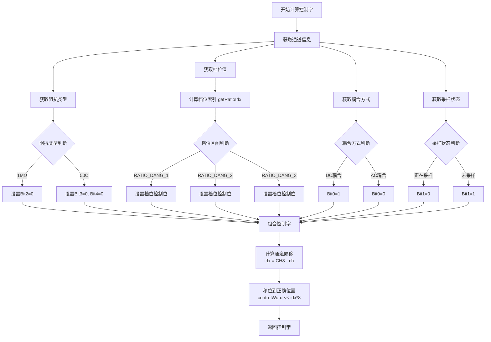
```mermaid
flowchart TD
    A[开始计算控制字] --> B[获取通道信息]
    B --> C[获取阻抗类型]
    B --> D[获取档位值]
    B --> E[获取耦合方式]
    B --> F[获取采样状态]
    
    C --> G{阻抗类型判断}
    G -->|1MΩ| H[设置Bit2=0]
    G -->|50Ω| I[设置Bit3=0, Bit4=0]
    
    D --> J[计算档位索引 getRatioIdx]
    J --> K{档位区间判断}
    
    K -->|RATIO_DANG_1| L[设置档位控制位]
    K -->|RATIO_DANG_2| M[设置档位控制位]
    K -->|RATIO_DANG_3| N[设置档位控制位]
    
    E --> O{耦合方式判断}
    O -->|DC耦合| P[Bit0=1]
    O -->|AC耦合| Q[Bit0=0]
    
    F --> R{采样状态判断}
    R -->|正在采样| S[Bit1=0]
    R -->|未采样| T[Bit1=1]
    
    H --> U[组合控制字]
    I --> U
    L --> U
    M --> U
    N --> U
    P --> U
    Q --> U
    S --> U
    T --> U
    
    U --> V[计算通道偏移<br/>idx = CH8 - ch]
    V --> W[移位到正确位置<br/>controlWord << idx*8]
    W --> X[返回控制字]
```

### 4.2 控制字示例

#### 示例1：CH1，1MΩ阻抗，DC耦合，正在采样，RATIO\_DANG\_1档位

```
通道: CH1 (ch=0, idx=7)
阻抗: 1MΩ
耦合: DC
采样: 是
档位: RATIO_DANG_1 (≤10mV)

控制字计算:
═══════════════════════════════════════════════════════════════
Bit 0: DC耦合 = 1 (默认)
Bit 1: 正在采样 = 0 (清除)
Bit 2: 1MΩ选择 = 0 (清除)
Bit 3: 未使用 = 1 (默认)
Bit 4: RATIO_DANG_1 = 0 (清除)
Bit 5: 未使用 = 1 (默认)
Bit 6: 未使用 = 1 (默认)
Bit 7: RATIO_DANG_1 = 0 (清除)
───────────────────────────────────────────────────────────────
单通道控制字: 0b_0_1_1_0_1_0_0_1 = 0x69
═══════════════════════════════════════════════════════════════

移位计算:
idx = CH8 - CH1 = 7 - 0 = 7
最终控制字 = 0x69 << (7 * 8) = 0x6900000000000000

64位完整控制字:
┌────────┬────────┬────────┬────────┬────────┬────────┬────────┬────────┐
│  CH1   │  CH2   │  CH3   │  CH4   │  CH5   │  CH6   │  CH7   │  CH8   │
│ 0x69   │ 0xFF   │ 0xFF   │ 0xFF   │ 0xFF   │ 0xFF   │ 0xFF   │ 0xFF   │
└────────┴────────┴────────┴────────┴────────┴────────┴────────┴────────┘
```

#### 示例2：CH4，50Ω阻抗，DC耦合，正在采样，RATIO\_DANG\_2档位

```
通道: CH4 (ch=3, idx=4)
阻抗: 50Ω
耦合: DC
采样: 是
档位: RATIO_DANG_2 (20mV~100mV)

控制字计算:
═══════════════════════════════════════════════════════════════
Bit 0: DC耦合 = 1 (默认)
Bit 1: 正在采样 = 0 (清除)
Bit 2: 未使用 = 1 (默认)
Bit 3: 50Ω选择 = 0 (清除)
Bit 4: 50Ω通用 = 0 (清除)
Bit 5: 未使用 = 1 (默认)
Bit 6: RATIO_DANG_2 = 0 (清除)
Bit 7: RATIO_DANG_2 = 1 (默认)
───────────────────────────────────────────────────────────────
单通道控制字: 0b_1_0_1_0_0_1_0_1 = 0xA5
═══════════════════════════════════════════════════════════════

移位计算:
idx = CH8 - CH4 = 7 - 3 = 4
最终控制字 = 0xA5 << (4 * 8) = 0x0000A50000000000

64位完整控制字:
┌────────┬────────┬────────┬────────┬────────┬────────┬────────┬────────┐
│  CH1   │  CH2   │  CH3   │  CH4   │  CH5   │  CH6   │  CH7   │  CH8   │
│ 0xFF   │ 0xFF   │ 0xFF   │ 0xA5   │ 0xFF   │ 0xFF   │ 0xFF   │ 0xFF   │
└────────┴────────┴────────┴────────┴────────┴────────┴────────┴────────┘
```

### 4.3 PD值（Power Down值）结构

```
═══════════════════════════════════════════════════════════════════════
PD值结构 (64位，每个通道8位)
═══════════════════════════════════════════════════════════════════════

PD值用于控制PGA(AD8370)的Power Down模式

档位区间      PD控制码    二进制表示
─────────────────────────────────────────────────────────────────────
RATIO_DANG_1   0x06       0b_0000_0110
RATIO_DANG_2   0x0D       0b_0000_1101
RATIO_DANG_3   0x0B       0b_0000_1011

计算方式: pdVal |= (controlCode << (ch * 8))

═══════════════════════════════════════════════════════════════════════
```

### 4.4 完整控制流程图

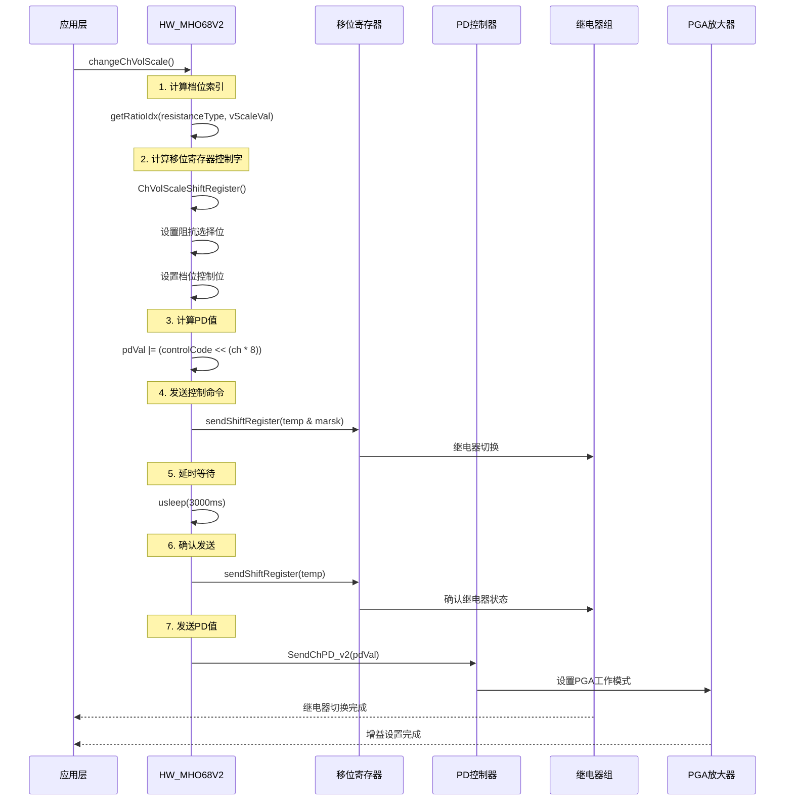
```mermaid
sequenceDiagram
    participant App as 应用层
    participant HW as HW_MHO68V2
    participant SR as 移位寄存器
    participant PD as PD控制器
    participant Relay as 继电器组
    participant PGA as PGA放大器
    
    App->>HW: changeChVolScale()
    
    Note over HW: 1. 计算档位索引
    HW->>HW: getRatioIdx(resistanceType, vScaleVal)
    
    Note over HW: 2. 计算移位寄存器控制字
    HW->>HW: ChVolScaleShiftRegister()
    HW->>HW: 设置阻抗选择位
    HW->>HW: 设置档位控制位
    
    Note over HW: 3. 计算PD值
    HW->>HW: pdVal |= (controlCode << (ch * 8))
    
    Note over HW: 4. 发送控制命令
    HW->>SR: sendShiftRegister(temp & marsk)
    SR->>Relay: 继电器切换
    
    Note over HW: 5. 延时等待
    HW->>HW: usleep(3000ms)
    
    Note over HW: 6. 确认发送
    HW->>SR: sendShiftRegister(temp)
    SR->>Relay: 确认继电器状态
    
    Note over HW: 7. 发送PD值
    HW->>PD: SendChPD_v2(pdVal)
    PD->>PGA: 设置PGA工作模式
    
    Relay-->>App: 继电器切换完成
    PGA-->>App: 增益设置完成
```

***

## 五、Calibrate包完整分析

### 5.1 包结构概览

```
Calibrate/
├── 核心接口和基类
│   ├── IHW.java              # 硬件抽象接口
│   ├── IADC.java             # ADC抽象接口
│   ├── HW.java               # 硬件抽象基类
│   └── ADC.java              # ADC抽象基类
├── 配置和管理类
│   ├── HwConfig.java         # 硬件配置管理
│   └── CabteRegister.java    # 校准寄存器管理
├── 校准服务类
│   ├── CalibrateService.java # 校准服务管理
│   ├── Calibrate.java        # 校准抽象基类
│   ├── SelfCalibrate.java    # 自校准管理
│   ├── FactorCalibrate.java  # 工厂校准管理
│   └── ProbeCalibrate.java   # 探头校准管理
├── 算法类
│   └── Wucha.java            # 误差趋近算法
├── ADC实现类
│   ├── ADC_EV12AQ60x.java    # EV12AQ60x ADC
│   ├── ADC_CAE2400.java      # CAE2400 ADC
│   ├── ADC_MXT2022.java      # MXT2022 ADC
│   └── ADC_B12DJ3200NBB.java # B12DJ3200NBB ADC
├── MHO68v2/                  # MHO68V2型号实现
│   ├── HW_MHO68V2.java
│   ├── MHO68v2_ZeroCalibrate.java
│   ├── MHO68v2_ZeroCalibrateEx.java
│   ├── MHO68v2_ChGainCalibrate.java
│   ├── MHO68v2_ChGainCalibrateEx.java
│   ├── MHO68v2_ChCapCalibrate.java
│   └── MHO68v2_ChCofitCalibrateEx.java
├── MHO68v1/                  # MHO68V1型号实现
│   └── ... (类似结构)
└── MHO38v1/                  # MHO38V1型号实现
    └── ... (类似结构)
```

### 5.2 各类详细作用分析

#### 5.2.1 核心接口和基类

##### IHW\.java - 硬件抽象接口

```java
public interface IHW {
    // PGA增益控制
    void setChPga();
    void setChPgaGain(int[] val);
    void setAdGain(int fpgaIdx);
    
    // 通道电源控制
    void ChPowerEnable(boolean bEnable);
    
    // 垂直档位控制（继电器）
    void changeChVolScale();
    
    // 校准数据管理
    void clearCalibrationState();
    void saveCalibrationState();
    int loadCalibration();
    boolean saveCalibration();
    boolean saveFactoryCalibration();
    boolean saveUserCalibration();
    
    // 校准状态管理
    void setCalibrationState(int idx, boolean bState);
    boolean isCalibrationState(int idx);
    void backUpCabteRegister();
    void restoreCabteRegister();
    
    // 校准项管理
    List<String> getCalibrationItems();
    boolean getCalibrationItemState(int idx, StringBuilder sb);
}
```

**作用**：定义示波器硬件抽象层接口，包括PGA控制、继电器控制、校准数据存储等核心功能。

##### IADC.java - ADC抽象接口

```java
public interface IADC {
    void Init();
    void setOffset(int fpgaIdx, int adIdx, int i0_q1, int vol);
    void setGain(int fpgaIdx, int adIdx, int i0_q1, int vol);
    void setChannel(int cnt, boolean[] sel);
    void setCalibrate();
    int getSampleChannel(boolean[] sel);
    int getMaxAdInClk();
    int getMaxChNums();
    boolean isChChangeReset();
}
```

**作用**：定义ADC芯片控制接口，包括偏移、增益、通道选择等功能。

##### HW\.java - 硬件抽象基类

```java
public abstract class HW implements IHW {
    // 移位寄存器控制
    public void sendShiftRegister(long val);
    
    // PGA增益设置
    public void setChPgaGain(int[] val);
    
    // 校准数据存储/加载
    protected int readCalibrateParam(final String fileName);
    protected boolean saveCalibrateParam(final String fileName);
    
    // 抽象方法 - 子类实现
    public abstract void defaultVal();
    public abstract double calc_coefChannel(int chIdx, double scaleVal, int idx);
    public abstract void calc_pga_fs_gain(int cnt, int chIdx, int resistanceType, double scaleVal, int[] result);
    public abstract float getChannelCoef(int chIdx, int dang, int idx);
    public abstract void setChannelCoef(int chIdx, int dang, int idx, float val);
    // ... 更多抽象方法
}
```

**作用**：提供硬件控制的通用实现，包括移位寄存器控制、校准数据存储、系数计算等。子类针对不同型号实现具体逻辑。

##### ADC.java - ADC抽象基类

```java
public abstract class ADC implements IADC {
    protected FPGACommand fpgaCommand;
    
    protected void SendADData(int fpgaIdx, int adIdx, int addr, int val);
    protected void AD_JMode(int fpgaIdx, int val, int v);
    
    // 通道采样数计算
    public int getSampleChannel(boolean[] sel);
}
```

**作用**：提供ADC控制的通用实现，子类针对不同ADC芯片实现具体控制逻辑。

#### 5.2.2 配置和管理类

##### HwConfig.java - 硬件配置管理

```java
public class HwConfig {
    // ADC和HW实例
    private ADC adc;
    private HW hw;
    
    // 硬件参数
    private int adBits;           // ADC位数
    private int adMaxVal;         // ADC最大值
    private int triggerLevelFactor;
    private double adFSR;         // ADC满量程范围
    private int fpgaNums;         // FPGA数量
    private int adcNums;          // ADC数量
    
    // 默认配置
    private float[] defaultChCoef;  // 默认通道系数
    private int[] defaultAdFS;      // 默认ADC满量程
    private short[] defaultPga;     // 默认PGA配置
    
    // 根据产品型号创建配置
    private static HwConfig allocMHO();
}
```

**作用**：根据产品型号（MHO38V1/MHO68V1/MHO68V2）创建对应的硬件配置，包括ADC、HW实例和各项参数。

##### CabteRegister.java - 校准寄存器管理

```java
public class CabteRegister {
    private HW hw;
    
    // 通道系数管理
    public float getChannelCoef(int chIdx, int dang, int idx);
    public void setChannelCoef(int chIdx, int dang, int idx, float val);
    
    // 零点管理
    public void setChannelZero(int chIdx, int dwIdx, int pga, float val);
    public float getChannelZero(int chIdx, int dwIdx, int pga);
    
    // ADC偏移和增益
    public void setAdOffset(int chIdx, int chmode, int adIdx, int val);
    public int getADOffset(int chIdx, int chmode, int adIdx);
    public void setChGain(int chIdx, int resistanceType, int vIdx, int chMode, int adIdx, int val);
    public int getChGain(int chIdx, int resistanceType, int vIdx, int chMode, int adIdx);
    
    // 校准数据存储
    public boolean saveFactoryCalibrateParam();
    public boolean saveUserCalibrateParam();
    
    // 备份和恢复
    public void backUpCabteRegister();
    public void restoreCabteRegister();
}
```

**作用**：管理校准数据的存取，作为应用层和硬件层之间的桥梁，提供统一的校准数据访问接口。

#### 5.2.3 校准服务类

##### CalibrateService.java - 校准服务管理

```java
public class CalibrateService implements Observer {
    // 校准类型定义
    public static final int ZERO_CALIBRATE = 0;      // 零点校准
    public static final int AD_OFFSET_CALIBRATE = 1; // ADC偏移校准
    public static final int CHCOEF_CALIBRATE = 2;    // 偏移量系数校准
    public static final int CHGAIN_CALIBRATE = 3;    // 通道增益校准
    public static final int CHCAP_CALIBRATE = 4;     // 电容校准
    public static final int CH_ZERO_CALIBRATE = 5;   // 通道零点校准
    public static final int PROBE_DA_CALIBRATE = 6;  // 探头DA校准
    
    // 校准实例数组
    private Calibrate[] calibrates = new Calibrate[MAX_CALIBRATE];
    
    // 根据产品型号初始化校准实例
    private void initCalibrate();
    
    // 启动校准
    public void start(int calibrateType);
    
    // 结束校准
    public void end();
}
```

**作用**：校准服务的核心管理类，负责创建和管理各种校准实例，处理校准消息和状态机。

##### Calibrate.java - 校准抽象基类

```java
public abstract class Calibrate {
    // 校准生命周期
    public void iniCalibrate();      // 初始化
    public void endCalibrate();      // 结束
    
    // 校准准备和执行
    public abstract void iniCalibrateReg();     // 初始化校准寄存器
    public abstract void calibratePrepare();    // 校准准备
    public abstract boolean onCalibrate();      // 执行校准
    
    // 结果管理
    public abstract int getErrcode();           // 获取错误码
    public abstract void setErrcode(int errcode);
    
    // 波形同步
    public void fpgaSync();
    public void updateSync();
}
```

**作用**：定义校准的通用流程和模板方法，子类实现具体的校准逻辑。

##### SelfCalibrate.java - 自校准管理

```java
public class SelfCalibrate implements Observer {
    // 校准状态数组
    private final int[] stateArray = {
        CalibrateService.ZERO_CALIBRATE,
        CalibrateService.CH_ZERO_CALIBRATE,
    };
    
    // 开始自校准
    public void begin();
    
    // 强制结束
    public void forEnd();
    
    // 状态机
    private void selfStateMachine(int err);
}
```

**作用**：管理用户自校准流程，按顺序执行零点校准等校准项目。

##### FactorCalibrate.java - 工厂校准管理

```java
public class FactorCalibrate implements Observer {
    // 上半部校准项目
    private int[] stateArray_upPart = {
        CalibrateService.ZERO_CALIBRATE,
    };
    
    // 下半部校准项目
    private int[] stateArray_downPart = {
        CalibrateService.ZERO_CALIBRATE,
    };
    
    // 开始校准
    public void begin(int idx);
    public void begin(int idx, Object param);
    public void begin_upPard();
    public void begin_downPard();
    
    // 强制结束
    public void forceEnd();
}
```

**作用**：管理工厂校准流程，支持上半部、下半部和独立项校准。

#### 5.2.4 算法类

##### Wucha.java - 误差趋近算法

```java
public class Wucha {
    private int wuChaCnt;      // 状态机计数
    private float volStep;     // 步进值
    private float stdVol;      // 标准值
    private boolean zero_or_coef;  // 零点或系数校准
    
    // 核心处理方法
    public int process(float nowVol, int lastSet);
    
    // 判断是否完成
    public boolean isFinished();
    
    // 获取最佳值
    public int getBestSetVol();
    public float getBestCalVol();
}
```

**作用**：实现误差趋近算法，用于校准过程中自动调整参数使测量值趋近标准值。

#### 5.2.5 硬件实现类

##### HW\_MHO68V2.java - MHO68V2型号硬件实现

```java
public class HW_MHO68V2 extends HW {
    // 继电器控制
    @Override
    public void changeChVolScale();
    
    // PGA设置
    @Override
    public void setChPga();
    
    // ADC增益设置
    @Override
    public void setAdGain(int fpgaIdx);
    
    // 通道电源控制
    @Override
    public void ChPowerEnable(boolean bEnable);
    
    // 档位索引计算
    public int getRatioIdx(int resistanceType, double v);
    
    // 校准系数计算
    public double calc_coefChannel(int chIdx, double scaleVal, int idx);
    public void calc_pga_fs_gain(int cnt, int chIdx, int resistanceType, double scaleVal, int[] result);
}
```

**作用**：实现MHO68V2型号的硬件控制，包括继电器控制、PGA设置、ADC增益设置等。

##### ADC\_EV12AQ60x.java - EV12AQ60x ADC实现

```java
public class ADC_EV12AQ60x extends ADC {
    // 偏移设置
    @Override
    public void setOffset(int fpgaIdx, int adIdx, int i0_q1, int vol);
    
    // 增益设置
    @Override
    public void setGain(int fpgaIdx, int adIdx, int i0_q1, int vol);
    
    // 通道选择
    @Override
    public void setChannel(int cnt, boolean[] sel);
    
    // 采样通道计算
    @Override
    public int getSampleChannel(boolean[] sel);
}
```

**作用**：实现EV12AQ60x ADC芯片的具体控制逻辑。

#### 5.2.6 校准实现类

##### MHO68v2\_ZeroCalibrate.java - 零点校准

```java
public class MHO68v2_ZeroCalibrate extends Calibrate {
    @Override
    public void calibratePrepare() {
        // 设置通道、档位、阻抗
        // 设置PGA值
    }
    
    @Override
    public boolean onCalibrate() {
        // 1. 获取波形数据
        // 2. 计算平均值
        // 3. 状态机调整零点
        // 4. 判断是否完成
    }
}
```

**作用**：实现零点校准，通过调整零点偏移使波形平均值趋近于零。

##### MHO68v2\_ChGainCalibrate.java - 通道增益校准

```java
public class MHO68v2_ChGainCalibrate extends Calibrate {
    @Override
    public void calibratePrepare() {
        // 设置标准信号参数
        // 配置通道、档位、阻抗
        // 设置PGA和ADFS
    }
    
    @Override
    public boolean onCalibrate() {
        // 1. 获取波形数据
        // 2. 计算峰峰值
        // 3. 调整增益系数
        // 4. 判断是否完成
    }
}
```

**作用**：实现通道增益校准，通过输入标准信号调整增益系数使测量值准确。

### 5.3 类图

#### 5.3.1 核心类关系图

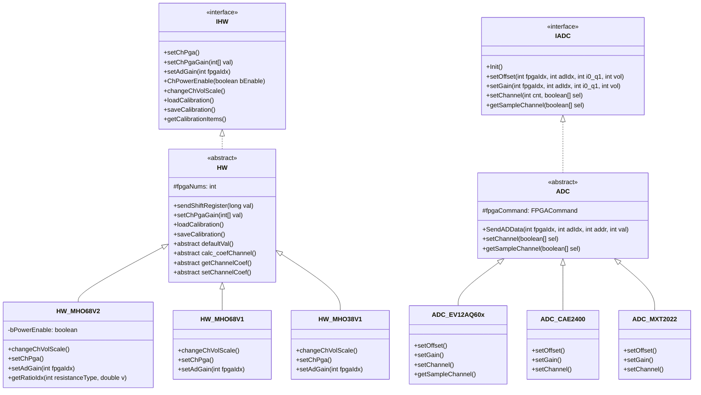
```mermaid
classDiagram
    class IHW {
        <<interface>>
        +setChPga()
        +setChPgaGain(int[] val)
        +setAdGain(int fpgaIdx)
        +ChPowerEnable(boolean bEnable)
        +changeChVolScale()
        +loadCalibration()
        +saveCalibration()
        +getCalibrationItems()
    }
    
    class IADC {
        <<interface>>
        +Init()
        +setOffset(int fpgaIdx, int adIdx, int i0_q1, int vol)
        +setGain(int fpgaIdx, int adIdx, int i0_q1, int vol)
        +setChannel(int cnt, boolean[] sel)
        +getSampleChannel(boolean[] sel)
    }
    
    class HW {
        <<abstract>>
        #fpgaNums: int
        +sendShiftRegister(long val)
        +setChPgaGain(int[] val)
        +loadCalibration()
        +saveCalibration()
        +abstract defaultVal()
        +abstract calc_coefChannel()
        +abstract getChannelCoef()
        +abstract setChannelCoef()
    }
    
    class ADC {
        <<abstract>>
        #fpgaCommand: FPGACommand
        +SendADData(int fpgaIdx, int adIdx, int addr, int val)
        +setChannel(boolean[] sel)
        +getSampleChannel(boolean[] sel)
    }
    
    class HW_MHO68V2 {
        -bPowerEnable: boolean
        +changeChVolScale()
        +setChPga()
        +setAdGain(int fpgaIdx)
        +getRatioIdx(int resistanceType, double v)
    }
    
    class HW_MHO68V1 {
        +changeChVolScale()
        +setChPga()
        +setAdGain(int fpgaIdx)
    }
    
    class HW_MHO38V1 {
        +changeChVolScale()
        +setChPga()
        +setAdGain(int fpgaIdx)
    }
    
    class ADC_EV12AQ60x {
        +setOffset()
        +setGain()
        +setChannel()
        +getSampleChannel()
    }
    
    class ADC_CAE2400 {
        +setOffset()
        +setGain()
        +setChannel()
    }
    
    class ADC_MXT2022 {
        +setOffset()
        +setGain()
        +setChannel()
    }
    
    IHW <|.. HW
    IADC <|.. ADC
    HW <|-- HW_MHO68V2
    HW <|-- HW_MHO68V1
    HW <|-- HW_MHO38V1
    ADC <|-- ADC_EV12AQ60x
    ADC <|-- ADC_CAE2400
    ADC <|-- ADC_MXT2022
```

#### 5.3.2 校准服务类图

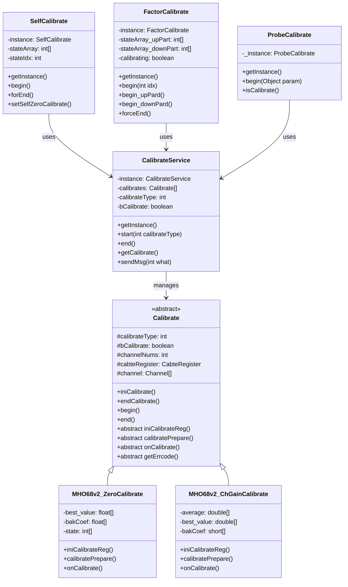
```mermaid
classDiagram
    class CalibrateService {
        -instance: CalibrateService
        -calibrates: Calibrate[]
        -calibrateType: int
        -bCalibrate: boolean
        +getInstance()
        +start(int calibrateType)
        +end()
        +getCalibrate()
        +sendMsg(int what)
    }
    
    class Calibrate {
        <<abstract>>
        #calibrateType: int
        #bCalibrate: boolean
        #channelNums: int
        #cabteRegister: CabteRegister
        #channel: Channel[]
        +iniCalibrate()
        +endCalibrate()
        +begin()
        +end()
        +abstract iniCalibrateReg()
        +abstract calibratePrepare()
        +abstract onCalibrate()
        +abstract getErrcode()
    }
    
    class SelfCalibrate {
        -instance: SelfCalibrate
        -stateArray: int[]
        -stateIdx: int
        +getInstance()
        +begin()
        +forEnd()
        +setSelfZeroCalibrate()
    }
    
    class FactorCalibrate {
        -instance: FactorCalibrate
        -stateArray_upPart: int[]
        -stateArray_downPart: int[]
        -calibrating: boolean
        +getInstance()
        +begin(int idx)
        +begin_upPard()
        +begin_downPard()
        +forceEnd()
    }
    
    class ProbeCalibrate {
        -_instance: ProbeCalibrate
        +getInstance()
        +begin(Object param)
        +isCalibrate()
    }
    
    class MHO68v2_ZeroCalibrate {
        -best_value: float[]
        -bakCoef: float[]
        -state: int[]
        +iniCalibrateReg()
        +calibratePrepare()
        +onCalibrate()
    }
    
    class MHO68v2_ChGainCalibrate {
        -average: double[]
        -best_value: double[]
        -bakCoef: short[]
        +iniCalibrateReg()
        +calibratePrepare()
        +onCalibrate()
    }
    
    CalibrateService --> Calibrate : manages
    Calibrate <|-- MHO68v2_ZeroCalibrate
    Calibrate <|-- MHO68v2_ChGainCalibrate
    SelfCalibrate --> CalibrateService : uses
    FactorCalibrate --> CalibrateService : uses
    ProbeCalibrate --> CalibrateService : uses
```

#### 5.3.3 配置管理类图

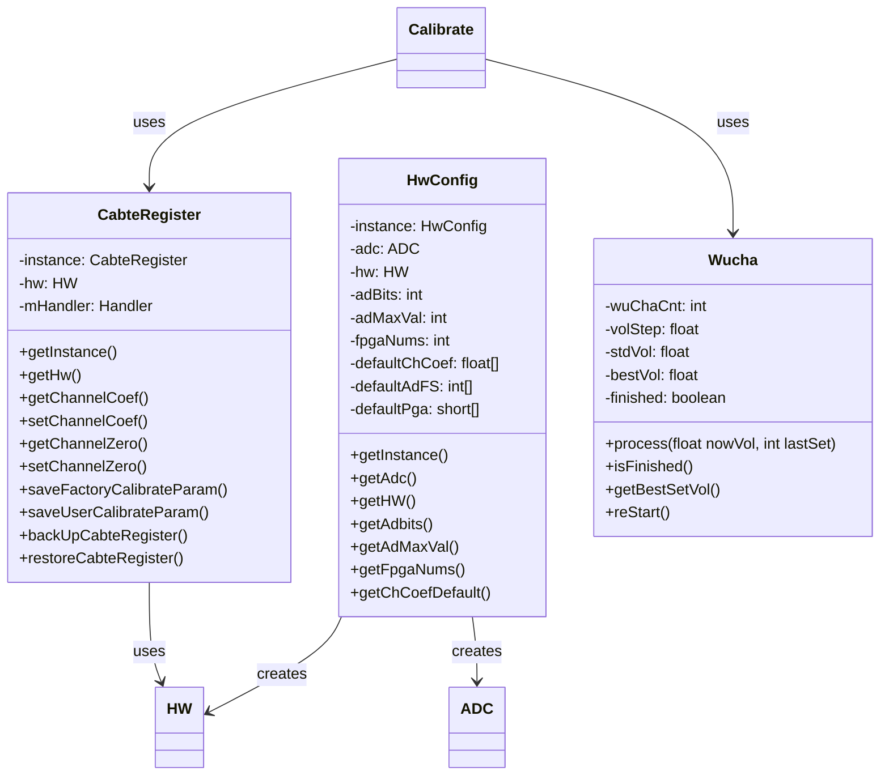
```mermaid
classDiagram
    class HwConfig {
        -instance: HwConfig
        -adc: ADC
        -hw: HW
        -adBits: int
        -adMaxVal: int
        -fpgaNums: int
        -defaultChCoef: float[]
        -defaultAdFS: int[]
        -defaultPga: short[]
        +getInstance()
        +getAdc()
        +getHW()
        +getAdbits()
        +getAdMaxVal()
        +getFpgaNums()
        +getChCoefDefault()
    }
    
    class CabteRegister {
        -instance: CabteRegister
        -hw: HW
        -mHandler: Handler
        +getInstance()
        +getHw()
        +getChannelCoef()
        +setChannelCoef()
        +getChannelZero()
        +setChannelZero()
        +saveFactoryCalibrateParam()
        +saveUserCalibrateParam()
        +backUpCabteRegister()
        +restoreCabteRegister()
    }
    
    class Wucha {
        -wuChaCnt: int
        -volStep: float
        -stdVol: float
        -bestVol: float
        -finished: boolean
        +process(float nowVol, int lastSet)
        +isFinished()
        +getBestSetVol()
        +reStart()
    }
    
    HwConfig --> HW : creates
    HwConfig --> ADC : creates
    CabteRegister --> HW : uses
    Calibrate --> CabteRegister : uses
    Calibrate --> Wucha : uses
```

### 5.4 时序图

#### 5.4.1 校准启动时序图

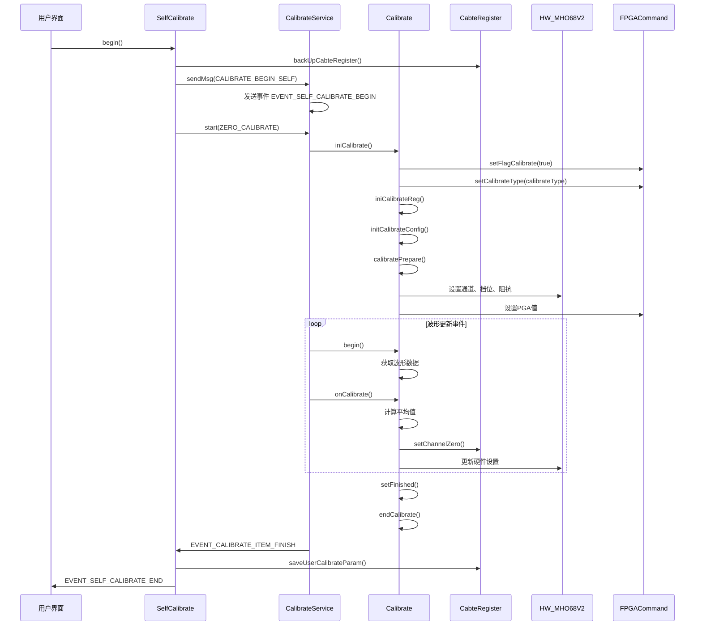
```mermaid
sequenceDiagram
    participant UI as 用户界面
    participant SC as SelfCalibrate
    participant CS as CalibrateService
    participant C as Calibrate
    participant CR as CabteRegister
    participant HW as HW_MHO68V2
    participant FPGA as FPGACommand
    
    UI->>SC: begin()
    SC->>CR: backUpCabteRegister()
    SC->>CS: sendMsg(CALIBRATE_BEGIN_SELF)
    CS->>CS: 发送事件 EVENT_SELF_CALIBRATE_BEGIN
    SC->>CS: start(ZERO_CALIBRATE)
    
    CS->>C: iniCalibrate()
    C->>FPGA: setFlagCalibrate(true)
    C->>FPGA: setCalibrateType(calibrateType)
    C->>C: iniCalibrateReg()
    C->>C: initCalibrateConfig()
    C->>C: calibratePrepare()
    C->>HW: 设置通道、档位、阻抗
    C->>FPGA: 设置PGA值
    
    loop 波形更新事件
        CS->>C: begin()
        C->>C: 获取波形数据
        CS->>C: onCalibrate()
        C->>C: 计算平均值
        C->>CR: setChannelZero()
        C->>HW: 更新硬件设置
    end
    
    C->>C: setFinished()
    C->>C: endCalibrate()
    CS->>SC: EVENT_CALIBRATE_ITEM_FINISH
    SC->>CR: saveUserCalibrateParam()
    SC->>UI: EVENT_SELF_CALIBRATE_END
```

#### 5.4.2 零点校准时序图

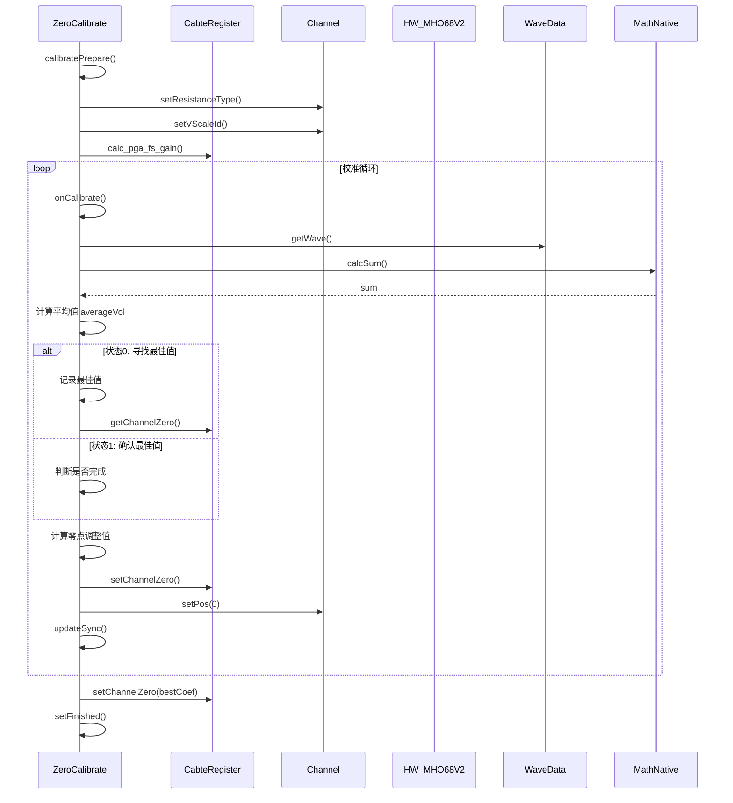
```mermaid
sequenceDiagram
    participant C as ZeroCalibrate
    participant CR as CabteRegister
    participant CH as Channel
    participant HW as HW_MHO68V2
    participant WD as WaveData
    participant MN as MathNative
    
    C->>C: calibratePrepare()
    C->>CH: setResistanceType()
    C->>CH: setVScaleId()
    C->>CR: calc_pga_fs_gain()
    
    loop 校准循环
        C->>C: onCalibrate()
        C->>WD: getWave()
        C->>MN: calcSum()
        MN-->>C: sum
        C->>C: 计算平均值 averageVol
        
        alt 状态0: 寻找最佳值
            C->>C: 记录最佳值
            C->>CR: getChannelZero()
        else 状态1: 确认最佳值
            C->>C: 判断是否完成
        end
        
        C->>C: 计算零点调整值
        C->>CR: setChannelZero()
        C->>CH: setPos(0)
        C->>C: updateSync()
    end
    
    C->>CR: setChannelZero(bestCoef)
    C->>C: setFinished()
```

#### 5.4.3 继电器控制时序图

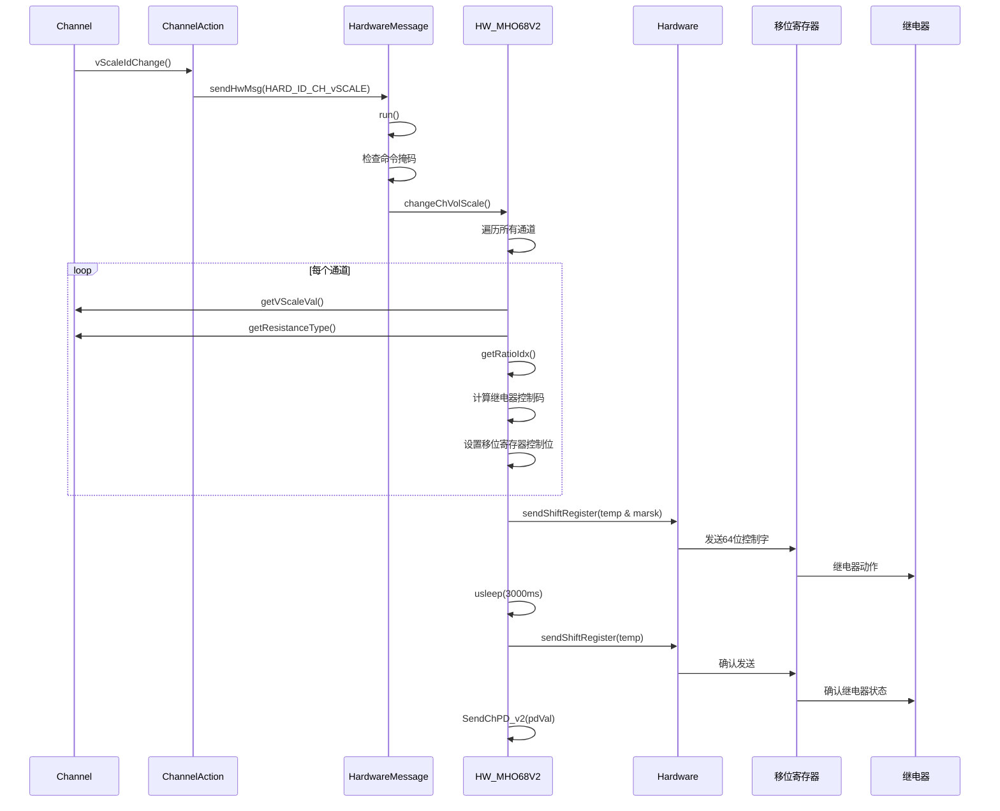
```mermaid
sequenceDiagram
    participant CH as Channel
    participant CA as ChannelAction
    participant HM as HardwareMessage
    participant HW as HW_MHO68V2
    participant HD as Hardware
    participant SR as 移位寄存器
    participant R as 继电器
    
    CH->>CA: vScaleIdChange()
    CA->>HM: sendHwMsg(HARD_ID_CH_vSCALE)
    
    HM->>HM: run()
    HM->>HM: 检查命令掩码
    HM->>HW: changeChVolScale()
    
    HW->>HW: 遍历所有通道
    loop 每个通道
        HW->>CH: getVScaleVal()
        HW->>CH: getResistanceType()
        HW->>HW: getRatioIdx()
        HW->>HW: 计算继电器控制码
        HW->>HW: 设置移位寄存器控制位
    end
    
    HW->>HD: sendShiftRegister(temp & marsk)
    HD->>SR: 发送64位控制字
    SR->>R: 继电器动作
    
    HW->>HW: usleep(3000ms)
    
    HW->>HD: sendShiftRegister(temp)
    HD->>SR: 确认发送
    SR->>R: 确认继电器状态
    
    HW->>HW: SendChPD_v2(pdVal)
```

### 5.5 数据流程图

#### 5.5.1 校准数据存储流程

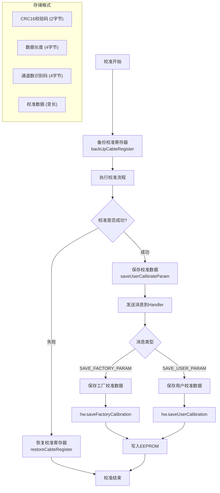
```mermaid
flowchart TD
    A[校准开始] --> B[备份校准寄存器<br/>backUpCabteRegister]
    B --> C[执行校准流程]
    C --> D{校准是否成功?}
    
    D -->|成功| E[保存校准数据<br/>saveUserCalibrateParam]
    D -->|失败| F[恢复校准寄存器<br/>restoreCabteRegister]
    
    E --> G[发送消息到Handler]
    G --> H{消息类型}
    
    H -->|SAVE_FACTORY_PARAM| I[保存工厂校准数据]
    H -->|SAVE_USER_PARAM| J[保存用户校准数据]
    
    I --> K[hw.saveFactoryCalibration]
    J --> L[hw.saveUserCalibration]
    
    K --> M[写入EEPROM]
    L --> M
    
    F --> N[校准结束]
    M --> N
    
    subgraph 存储格式
        O["CRC16校验码 (2字节)"]
        P["数据长度 (4字节)"]
        Q["通道数识别码 (4字节)"]
        R["校准数据 (变长)"]
    end
```

#### 5.5.2 校准系数计算流程

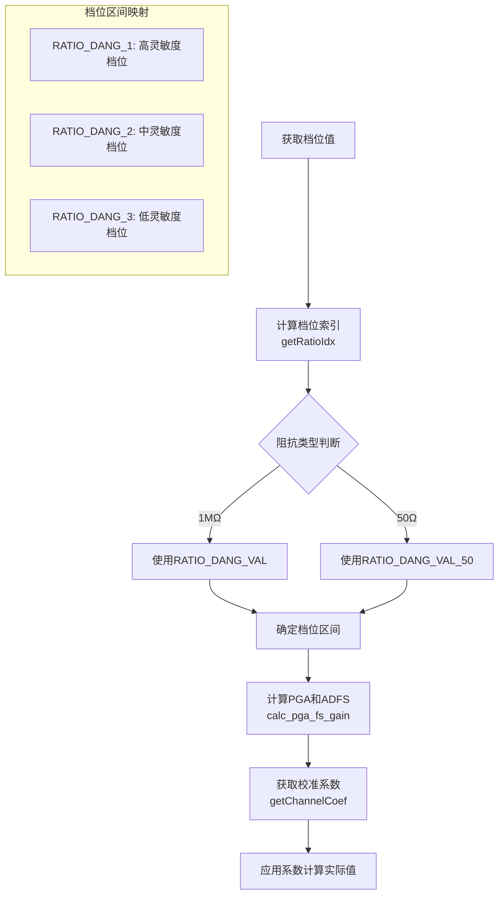
```mermaid
flowchart TD
    A[获取档位值] --> B[计算档位索引<br/>getRatioIdx]
    B --> C{阻抗类型判断}
    
    C -->|1MΩ| D[使用RATIO_DANG_VAL]
    C -->|50Ω| E[使用RATIO_DANG_VAL_50]
    
    D --> F[确定档位区间]
    E --> F
    
    F --> G[计算PGA和ADFS<br/>calc_pga_fs_gain]
    G --> H[获取校准系数<br/>getChannelCoef]
    H --> I[应用系数计算实际值]
    
    subgraph 档位区间映射
        J["RATIO_DANG_1: 高灵敏度档位"]
        K["RATIO_DANG_2: 中灵敏度档位"]
        L["RATIO_DANG_3: 低灵敏度档位"]
    end
```

#### 5.5.3 硬件配置初始化流程

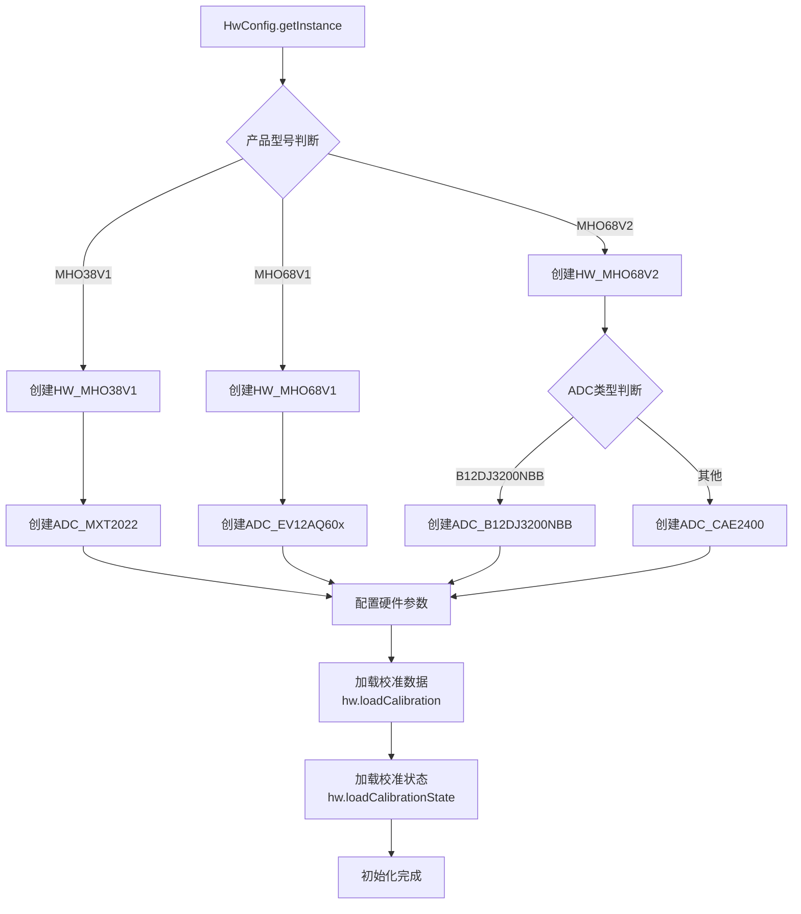
```mermaid
flowchart TD
    A[HwConfig.getInstance] --> B{产品型号判断}
    
    B -->|MHO38V1| C[创建HW_MHO38V1]
    B -->|MHO68V1| D[创建HW_MHO68V1]
    B -->|MHO68V2| E[创建HW_MHO68V2]
    
    C --> F[创建ADC_MXT2022]
    D --> G[创建ADC_EV12AQ60x]
    E --> H{ADC类型判断}
    
    H -->|B12DJ3200NBB| I[创建ADC_B12DJ3200NBB]
    H -->|其他| J[创建ADC_CAE2400]
    
    F --> K[配置硬件参数]
    G --> K
    I --> K
    J --> K
    
    K --> L[加载校准数据<br/>hw.loadCalibration]
    L --> M[加载校准状态<br/>hw.loadCalibrationState]
    M --> N[初始化完成]
```

### 5.6 状态机图

#### 5.6.1 校准服务状态机

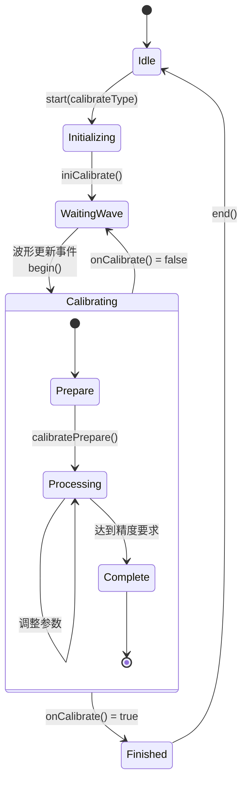
```mermaid
stateDiagram-v2
    [*] --> Idle
    
    Idle --> Initializing : start(calibrateType)
    
    Initializing --> WaitingWave : iniCalibrate()
    
    WaitingWave --> Calibrating : 波形更新事件<br/>begin()
    
    Calibrating --> WaitingWave : onCalibrate() = false
    Calibrating --> Finished : onCalibrate() = true
    
    Finished --> Idle : end()
    
    state Calibrating {
        [*] --> Prepare
        Prepare --> Processing : calibratePrepare()
        Processing --> Processing : 调整参数
        Processing --> Complete : 达到精度要求
        Complete --> [*]
    }
```

#### 5.6.2 零点校准状态机

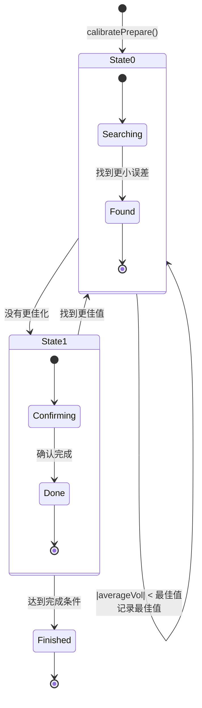
```mermaid
stateDiagram-v2
    [*] --> State0: calibratePrepare()
    
    State0 --> State0: |averageVol| < 最佳值<br/>记录最佳值
    State0 --> State1: 没有更佳化
    
    State1 --> State0: 找到更佳值
    State1 --> Finished: 达到完成条件
    
    state State0 {
        [*] --> Searching
        Searching --> Found: 找到更小误差
        Found --> [*]
    }
    
    state State1 {
        [*] --> Confirming
        Confirming --> Done: 确认完成
        Done --> [*]
    }
    
    Finished --> [*]
```

### 5.7 架构图

#### 5.7.1 整体架构图

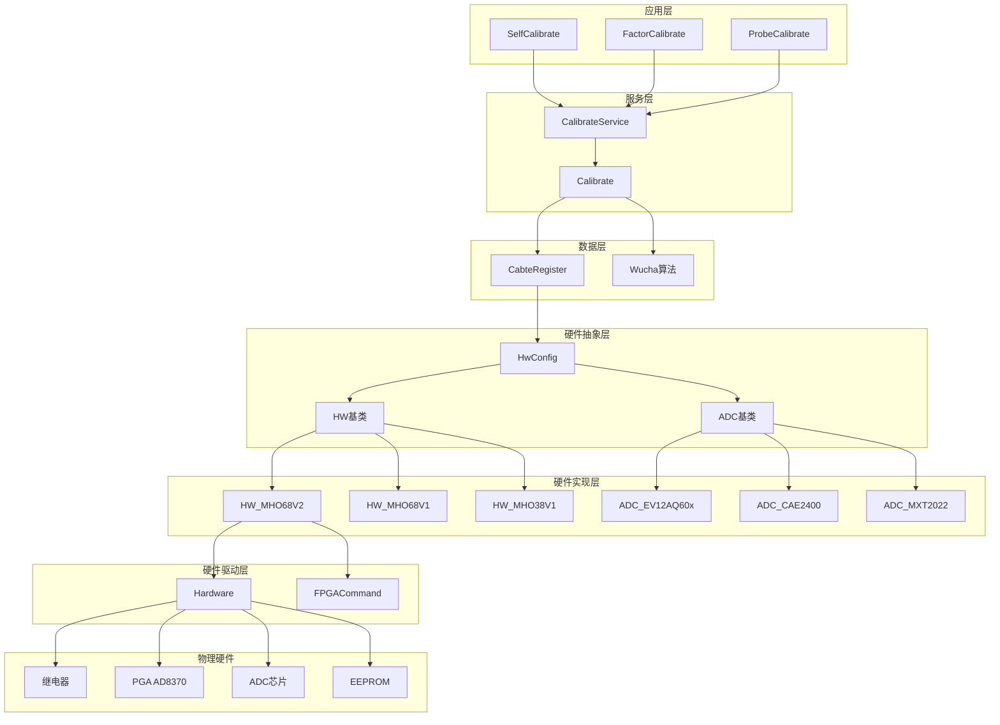
```mermaid
flowchart TB
    subgraph 应用层
        A[SelfCalibrate]
        B[FactorCalibrate]
        C[ProbeCalibrate]
    end
    
    subgraph 服务层
        D[CalibrateService]
        E[Calibrate]
    end
    
    subgraph 数据层
        F[CabteRegister]
        G[Wucha算法]
    end
    
    subgraph 硬件抽象层
        H[HwConfig]
        I[HW基类]
        J[ADC基类]
    end
    
    subgraph 硬件实现层
        K[HW_MHO68V2]
        L[HW_MHO68V1]
        M[HW_MHO38V1]
        N[ADC_EV12AQ60x]
        O[ADC_CAE2400]
        P[ADC_MXT2022]
    end
    
    subgraph 硬件驱动层
        Q[Hardware]
        R[FPGACommand]
    end
    
    subgraph 物理硬件
        S[继电器]
        T[PGA AD8370]
        U[ADC芯片]
        V[EEPROM]
    end
    
    A --> D
    B --> D
    C --> D
    D --> E
    E --> F
    E --> G
    F --> H
    H --> I
    H --> J
    I --> K
    I --> L
    I --> M
    J --> N
    J --> O
    J --> P
    K --> Q
    K --> R
    Q --> S
    Q --> T
    Q --> U
    Q --> V
```

### 5.8 关键代码位置索引

| 功能      | 文件                            | 关键方法                                   |
| ------- | ----------------------------- | -------------------------------------- |
| 硬件接口定义  | IHW\.java                     | 所有接口方法                                 |
| ADC接口定义 | IADC.java                     | 所有接口方法                                 |
| 硬件基类实现  | HW\.java                      | sendShiftRegister(), loadCalibration() |
| 硬件配置    | HwConfig.java                 | allocMHO(), getInstance()              |
| 校准寄存器管理 | CabteRegister.java            | getChannelCoef(), setChannelZero()     |
| 校准服务    | CalibrateService.java         | start(), initCalibrate()               |
| 校准基类    | Calibrate.java                | iniCalibrate(), onCalibrate()          |
| 自校准     | SelfCalibrate.java            | begin(), selfStateMachine()            |
| 工厂校准    | FactorCalibrate.java          | begin\_upPard(), stateMachine()        |
| 继电器控制   | HW\_MHO68V2.java              | changeChVolScale()                     |
| 零点校准    | MHO68v2\_ZeroCalibrate.java   | onCalibrate()                          |
| 增益校准    | MHO68v2\_ChGainCalibrate.java | onCalibrate()                          |
| 误差算法    | Wucha.java                    | process()                              |

***

## 六、通道阻抗切换消息流程

### 6.1 整体流程图

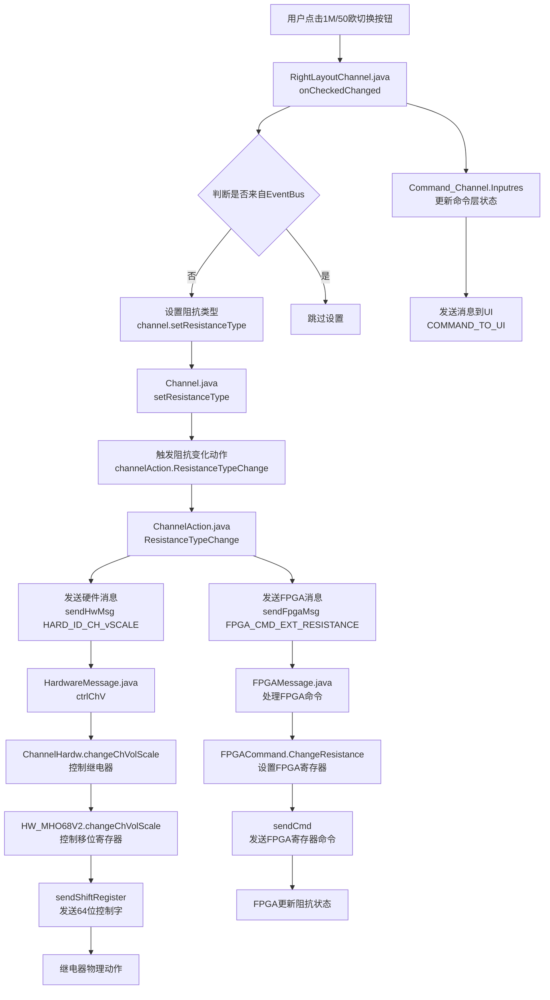
```mermaid
flowchart TD
    A[用户点击1M/50欧切换按钮] --> B[RightLayoutChannel.java<br/>onCheckedChanged]
    
    B --> C{判断是否来自EventBus}
    C -->|否| D[设置阻抗类型<br/>channel.setResistanceType]
    C -->|是| E[跳过设置]
    
    D --> F[Channel.java<br/>setResistanceType]
    F --> G[触发阻抗变化动作<br/>channelAction.ResistanceTypeChange]
    
    G --> H[ChannelAction.java<br/>ResistanceTypeChange]
    
    H --> I[发送硬件消息<br/>sendHwMsg HARD_ID_CH_vSCALE]
    H --> J[发送FPGA消息<br/>sendFpgaMsg FPGA_CMD_EXT_RESISTANCE]
    
    I --> K[HardwareMessage.java<br/>ctrlChV]
    K --> L[ChannelHardw.changeChVolScale<br/>控制继电器]
    
    J --> M[FPGAMessage.java<br/>处理FPGA命令]
    M --> N[FPGACommand.ChangeResistance<br/>设置FPGA寄存器]
    
    B --> O[Command_Channel.Inputres<br/>更新命令层状态]
    O --> P[发送消息到UI<br/>COMMAND_TO_UI]
    
    L --> Q[HW_MHO68V2.changeChVolScale<br/>控制移位寄存器]
    Q --> R[sendShiftRegister<br/>发送64位控制字]
    R --> S[继电器物理动作]
    
    N --> T[sendCmd<br/>发送FPGA寄存器命令]
    T --> U[FPGA更新阻抗状态]
```

### 6.2 详细代码流程

#### 6.2.1 UI层触发

**文件**: `RightLayoutChannel.java`

```java
} else if (viewId == rgImped.getId()) {
    int resistanceType = Channel.RESISTANCE_1M;
    if (!isFromEventBus) {
        if (item.getIndex() == 0) {
            resistanceType = Channel.RESISTANCE_1M;  // 1MΩ
        } else {
            resistanceType = Channel.RESISTANCE_50;  // 50Ω
        }
        // 路径1：设置Channel的阻抗类型
        channel.setResistanceType(resistanceType);
    }
    // 50Ω时AC耦合置灰
    this.rgCouple.setEnabled(1, resistanceType != Channel.RESISTANCE_50);
    
    // 路径2：发送命令到命令层
    Command.get().getChannel().Inputres(TChan.toFpgaChNo(channelNumber), item.getIndex(), false);
    
    // 发送消息更新UI
    msgChannel.setImped(item);
    sendMsgChannel(isFromEventBus);
}
```

#### 6.2.2 Channel层处理

**文件**: `Channel.java`

```java
public void setResistanceType(int resistanceType) {
    // 记录50Ω切换时间戳
    if(resistanceType == RESISTANCE_50){
        resistanceTS = SystemClock.elapsedRealtime();
    } else {
        resistanceTS = 0;
    }
    
    // 设置阻抗类型
    synchronized (this) {
        this.resistanceType = resistanceType;
    }
    
    // 触发阻抗类型变化动作 - 发送硬件和FPGA消息
    channelAction.ResistanceTypeChange();
    
    // 检查档位有效性，50Ω时某些档位不可用
    if(!isValidScaleIdExt(verticalAxis.getScaleId())){
        scaleIdBak = verticalAxis.getScaleId();  // 备份当前档位
        // 切换到有效档位
        if(isEnable_50O_700mV()){
            setVScaleId(VerticalAxis.DANG_1V, 0.7, true, false);
        } else {
            setVScaleId(HardwareProduct.isMHO68V1() ? VerticalAxis.DANG_500mV : VerticalAxis.DANG_1V, 1.0, true, false);
        }
    } else {
        // 切换回1MΩ时恢复备份档位
        if(resistanceType == RESISTANCE_1M && scaleIdBak != verticalAxis.getScaleId()){
            setVScaleId(scaleIdBak, 1.0, true, true);
        }
    }
}
```

#### 6.2.3 ChannelAction层发送消息

**文件**: `ChannelAction.java`

```java
public void ResistanceTypeChange(){
    int idx = channel.getChId();
    
    // 发送硬件消息 - 触发继电器控制
    // HARD_ID_CH_vSCALE: 垂直档位变化（包含阻抗切换）
    // HARD_ID_OFFSET: 偏移变化
    sendHwMsg(HardwareMessage.HARD_ID_CH_vSCALE_CH1 << (idx) | HardwareMessage.HARD_ID_OFFSET_CH1 << (idx));

    // 发送FPGA消息 - 更新FPGA寄存器
    sendFpgaMsg(
        // 基础命令
        FPGAMessage.FPGA_CMD_DIS_PIX_ch1 << (idx)
            | FPGAMessage.FPGA_CMD_TRIG_HUICHA
            | FPGAMessage.FPGA_CMD_TRIG_LEVEL
            | FPGAMessage.FPGA_CMD_Y_PLACE
            | FPGAMessage.FPGA_CMD_CH_OFFSET
            | FPGAMessage.FPGA_CMD_SAMP_MODE
            | FPGAMessage.FPGA_CMD_DIS,
        
        // 扩展命令
        FPGAMessage.FPGA_CMD_EXT_AD_ZERO
            | FPGAMessage.FPGA_CMD_EXT_AD_COEF
            | FPGAMessage.FPGA_CMD_EXT_RESISTANCE  // ← 阻抗变化标志
            | (FPGAMessage.FPGA_CMD_EXT_vScale_CHANGE_CH1 << idx)
    );
    
    sendEvent(EventFactory.EVENT_CHANNEL_IMPEDANCE);
}
```

#### 6.2.4 HardwareMessage处理硬件消息

**文件**: `HardwareMessage.java`

```java
private void ctrlChV(){
    ChannelHardw hardw = ChannelHardw.getInstance();
    FPGACommand cmd = FPGACommand.getInstance();
    
    // 控制设备延时
    cmd.cmdDevice(cmd.isCalibrate() ? 300 : 200);
    
    // 关键：控制继电器切换（包含阻抗选择继电器）
    hardw.changeChVolScale();
    
    // 设置PGA增益
    hardw.ctrlAD8370Gain();
    
    // 更新FPGA寄存器
    for(int i = 0; i < fpgaNums; i++) {
        hardw.wrte_ad_gain(i);
        cmd.updateChCapacitance(i);
        cmd.ADCalibrate();
        cmd.ChangeResistance(i);  // ← 更新阻抗状态到FPGA
        cmd.updataReg(i);
    }
    
    cmd.adSync();
}
```

#### 6.2.5 FPGAMessage处理FPGA消息

**文件**: `FPGAMessage.java`

```java
// 检查阻抗变化标志
if (isMask(FPGA_CMD[1] & FPGA_CMD_EXT_RESISTANCE)) {
    fpgaCommand.ChangeResistance(i);  // 调用FPGA命令更新阻抗
}
```

#### 6.2.6 FPGACommand更新FPGA寄存器

**文件**: `FPGACommand.java`

```java
public void ChangeResistance(int fpgaIdx) {
    // 获取阻抗寄存器
    FPGAReg_Resistance regResistance = 
        (FPGAReg_Resistance) getFPGAReg(fpgaIdx, FPGAReg.FPGA_CH_RESISTANCE);
    
    Channel channel;
    int val;
    int beginIdx = beginChIdx(fpgaIdx);
    int endIdx = endChIdx(fpgaIdx);
    
    // 遍历所有通道
    for (int i = beginIdx; i < endIdx; i++) {
        channel = ChannelFactory.getDynamicChannel(i);
        if (channel != null) {
            val = channel.getResistanceType();  // 获取阻抗类型
            regResistance.setResistance(i - beginIdx, val);  // 设置通道阻抗
            regResistance.setResistanceSel(i - beginIdx, 0);
        }
    }
    
    // 设置外部触发阻抗
    TriggerCommon triggerCommon = TriggerFactory.getInstance().getTriggerCommon();
    regResistance.setExtTrigger(triggerCommon.getExtTriggerInputRes());
    
    // 发送命令到FPGA
    sendCmd(regResistance);
}
```

#### 6.2.7 FPGA寄存器定义

**文件**: `FPGAReg_Resistance.java`

```java
public class FPGAReg_Resistance extends FPGAReg {
    FPGAReg_Resistance(){
        super(FPGAReg.FPGA_CH_RESISTANCE, 4);  // 4字节寄存器
    }
    
    // 设置通道阻抗值 (0=1MΩ, 1=50Ω)
    void setResistance(int chIdx, int vol){
        setVal(chIdx, 1, vol);  // 每个通道1位
    }
    
    // 设置外部触发阻抗
    void setExtTrigger(int val){
        setVal(8, 1, val);  // 第8位
    }
    
    // 设置阻抗选择
    void setResistanceSel(int chIdx, int v){
        setVal(16 + chIdx, 1, v);  // 第16位开始
    }
}
```

### 6.3 时序图

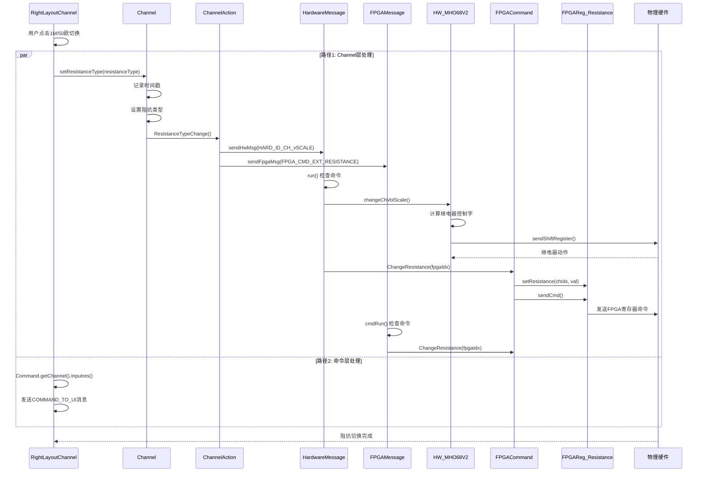
```mermaid
sequenceDiagram
    participant UI as RightLayoutChannel
    participant CH as Channel
    participant CA as ChannelAction
    participant HM as HardwareMessage
    participant FM as FPGAMessage
    participant HW as HW_MHO68V2
    participant FC as FPGACommand
    participant REG as FPGAReg_Resistance
    participant PHY as 物理硬件
    
    UI->>UI: 用户点击1M/50欧切换
    
    par 路径1: Channel层处理
        UI->>CH: setResistanceType(resistanceType)
        CH->>CH: 记录时间戳
        CH->>CH: 设置阻抗类型
        CH->>CA: ResistanceTypeChange()
        
        CA->>HM: sendHwMsg(HARD_ID_CH_vSCALE)
        CA->>FM: sendFpgaMsg(FPGA_CMD_EXT_RESISTANCE)
        
        HM->>HM: run() 检查命令
        HM->>HW: changeChVolScale()
        HW->>HW: 计算继电器控制字
        HW->>PHY: sendShiftRegister()
        PHY-->>HW: 继电器动作
        
        HM->>FC: ChangeResistance(fpgaIdx)
        FC->>REG: setResistance(chIdx, val)
        FC->>REG: sendCmd()
        REG->>PHY: 发送FPGA寄存器命令
        
        FM->>FM: cmdRun() 检查命令
        FM->>FC: ChangeResistance(fpgaIdx)
    and 路径2: 命令层处理
        UI->>UI: Command.getChannel().Inputres()
        UI->>UI: 发送COMMAND_TO_UI消息
    end
    
    PHY-->>UI: 阻抗切换完成
```

### 6.4 消息流向总结

| 层级       | 文件                       | 关键方法                 | 发送的消息                                            |
| -------- | ------------------------ | -------------------- | ------------------------------------------------ |
| UI层      | RightLayoutChannel.java  | onCheckedChanged     | -                                                |
| Channel层 | Channel.java             | setResistanceType    | -                                                |
| Action层  | ChannelAction.java       | ResistanceTypeChange | HARD\_ID\_CH\_vSCALE, FPGA\_CMD\_EXT\_RESISTANCE |
| 硬件消息层    | HardwareMessage.java     | ctrlChV              | 继电器控制命令                                          |
| FPGA消息层  | FPGAMessage.java         | cmdRun               | FPGA寄存器更新命令                                      |
| FPGA命令层  | FPGACommand.java         | ChangeResistance     | sendCmd()                                        |
| 寄存器层     | FPGAReg\_Resistance.java | setResistance        | 4字节寄存器数据                                         |

### 6.5 FPGA寄存器结构

```
FPGA_CH_RESISTANCE 寄存器 (4字节 = 32位)
═══════════════════════════════════════════════════════════════════

Bit 31-24: 保留
Bit 23-16: ResistanceSel[7:0] - 阻抗选择位
Bit 15-9:  保留
Bit 8:     ExtTrigger - 外部触发阻抗
Bit 7-4:   保留
Bit 3:     CH4 Resistance (0=1MΩ, 1=50Ω)
Bit 2:     CH3 Resistance (0=1MΩ, 1=50Ω)
Bit 1:     CH2 Resistance (0=1MΩ, 1=50Ω)
Bit 0:     CH1 Resistance (0=1MΩ, 1=50Ω)

═══════════════════════════════════════════════════════════════════
```

### 6.6 关键点总结

1. **双路径处理**：阻抗切换同时通过Channel层和Command层两条路径处理
2. **继电器控制**：阻抗切换会触发继电器动作，通过移位寄存器发送64位控制字
3. **档位联动**：切换到50Ω时，某些档位不可用，会自动切换到有效档位
4. **FPGA同步**：通过FPGA\_CMD\_EXT\_RESISTANCE标志通知FPGA更新阻抗状态
5. **UI联动**：50Ω时AC耦合选项会被禁用

***

## 七、波形功能完整分析

### 7.1 整体架构概览

波形功能是示波器的核心功能，从FPGA数据采集到界面波形显示涉及多个层次的处理。

```
┌─────────────────────────────────────────────────────────────────────────────┐
│                           波形数据流程架构                                    │
├─────────────────────────────────────────────────────────────────────────────┤
│                                                                             │
│  ┌─────────┐    ┌─────────────┐    ┌─────────────┐    ┌─────────────────┐  │
│  │  FPGA   │───▶│  XDMA驱动   │───▶│ SurfaceDevice│───▶│  DataFactory    │  │
│  │ 数据采集 │    │  DMA传输    │    │  数据接收    │    │  数据解析处理   │  │
│  └─────────┘    └─────────────┘    └─────────────┘    └─────────────────┘  │
│                                                                │            │
│                                                                ▼            │
│  ┌─────────────────────────────────────────────────────────────────────┐   │
│  │                        Channel数据缓冲区                             │   │
│  │  ┌───────────┐  ┌───────────┐  ┌───────────┐  ┌───────────┐        │   │
│  │  │ Channel 1 │  │ Channel 2 │  │ Channel 3 │  │ Channel 4 │  ...   │   │
│  │  │ WaveData  │  │ WaveData  │  │ WaveData  │  │ WaveData  │        │   │
│  │  └───────────┘  └───────────┘  └───────────┘  └───────────┘        │   │
│  └─────────────────────────────────────────────────────────────────────┘   │
│                                    │                                        │
│                                    ▼                                        │
│  ┌─────────────────────────────────────────────────────────────────────┐   │
│  │                        SurfacePreview渲染层                          │   │
│  │  ┌───────────────┐  ┌───────────────┐  ┌───────────────┐            │   │
│  │  │ LayerTexture  │  │ LayerTexture  │  │ LayerTexture  │  ...      │   │
│  │  │    CH1        │  │    CH2        │  │    MATH       │            │   │
│  │  └───────────────┘  └───────────────┘  └───────────────┘            │   │
│  └─────────────────────────────────────────────────────────────────────┘   │
│                                    │                                        │
│                                    ▼                                        │
│  ┌─────────────────────────────────────────────────────────────────────┐   │
│  │                        WaveZoneDisplay_YT显示层                      │   │
│  │  ┌───────────┐  ┌───────────┐  ┌───────────┐  ┌───────────┐        │   │
│  │  │ WaveGrid  │  │ WaveManage│  │ Cursor    │  │ Measure   │        │   │
│  │  │  网格绘制  │  │  波形绘制  │  │  光标绘制  │  │  测量绘制  │        │   │
│  │  └───────────┘  └───────────┘  └───────────┘  └───────────┘        │   │
│  └─────────────────────────────────────────────────────────────────────┘   │
│                                                                             │
└─────────────────────────────────────────────────────────────────────────────┘
```

### 7.2 核心类职责说明

| 层级        | 类名                  | 职责               | 文件路径                                  |
| --------- | ------------------- | ---------------- | ------------------------------------- |
| **硬件驱动层** | XDmaDevice          | XDMA DMA数据传输驱动   | scope/surface/XDmaDevice.java         |
| <br />    | XDmaDevManage       | 多FPGA设备管理        | scope/surface/XDmaDevManage.java      |
| <br />    | HwDevice            | 硬件设备抽象基类         | scope/surface/HwDevice.java           |
| **数据接收层** | SurfaceDevice       | 数据接收线程管理         | scope/surface/SurfaceDevice.java      |
| <br />    | SurfaceNative       | Native层Surface操作 | scope/surface/SurfaceNative.java      |
| **数据解析层** | DataFactory         | 数据解析工厂类          | scope/Data/DataFactory.java           |
| <br />    | SyncHeader          | 同步头解析            | scope/Data/SyncHeader.java            |
| <br />    | WaveData            | 波形数据存储结构         | scope/Data/WaveData.java              |
| **通道管理层** | Channel             | 通道属性管理           | scope/channel/Channel.java            |
| <br />    | ChannelFactory      | 通道工厂类            | scope/channel/ChannelFactory.java     |
| **渲染层**   | SurfacePreview      | OpenGL ES渲染管理    | scope/surface/SurfacePreview\.java    |
| <br />    | LayerTexture        | 图层纹理管理           | scope/surface/LayerTexture.java       |
| <br />    | Gray2RGBAFilter     | 灰度到彩色转换滤镜        | scope/surface/Gray2RGBAFilter.java    |
| **显示层**   | WaveZoneDisplay\_YT | YT模式显示视图         | app/wavezone/WaveZoneDisplay\_YT.java |
| <br />    | WaveManage          | 波形管理器            | app/wavezone/wave/WaveManage.java     |
| <br />    | WaveManage\_YT      | YT模式波形管理         | app/wavezone/wave/WaveManage\_YT.java |

### 7.3 详细调用流程

#### 7.3.1 第一阶段：FPGA数据采集与传输

```mermaid
sequenceDiagram
    participant FPGA as FPGA硬件
    participant XDMA as XDMA驱动
    participant XD as XDmaDevice
    participant XDM as XDmaDevManage
    participant SD as SurfaceDevice
    
    Note over FPGA: ADC采样数据
    FPGA->>XDMA: DMA传输请求
    XDMA->>XDMA: /dev/xdma0_c2h_0
    XDMA->>XDMA: /dev/xdma0_c2h_1
    
    loop 数据接收循环
        SD->>XDM: lockBuffer(idx)
        XDM->>XD: native_lock(idx)
        XD->>XDMA: 读取DMA缓冲区
        XDMA-->>XD: ByteBuffer数据
        XD-->>XDM: ByteBuffer
        XDM-->>SD: ByteBuffer
        
        SD->>SD: DataFactory.onRecv()
        
        SD->>XDM: unlockBuffer(idx)
        XDM->>XD: native_unlock(idx)
    end
```

**关键代码分析**：

**XDmaDevice.java** - Native方法调用

```java
// L264-L279: 锁定DMA缓冲区
@Override
public ByteBuffer lockBuffer(int idx){
    ByteBuffer byteBuffer = null;
    if(idx == this.idx) {
        if (isOpen()) {
            byteBuffer = native_lock(idx);  // 调用Native方法获取数据
        }
        if (byteBuffer == null) {
            ms_sleep(10);
        }
    }
    return byteBuffer;
}

@Override
public void unlockBuffer(int idx){
    native_unlock(idx);  // 解锁缓冲区
}

// Native方法声明
private native ByteBuffer native_lock(int idx);
private native void native_unlock(int idx);
```

**SurfaceDevice.java** - 数据接收线程

```java
// L84-L128: 数据接收主循环
@Override
public void run() {
    super.run();
    
    HwDevice hwDevice = DeviceFactory.allocDevice();
    if (hwDevice.isAsyncOpen()) {
        while (!hwDevice.isOpen() && isOpen()) {
            Thread.sleep(100);
        }
    } else {
        if (!hwDevice.isOpen()) {
            hwDevice.openDevice();
        }
    }
    
    int devcnt = hwDevice.getDevCnt();
    while (isOpen()) {
        List<Callable<Boolean>> list = new ArrayList<>();
        for (int i = 0; i < devcnt; i++) {
            int finalI = i;
            list.add(()->{
                ByteBuffer byteBuffer;
                DataFactory dataFactory = DataFactory.getInstance();
                while (isOpen()) {
                    byteBuffer = hwDevice.lockBuffer(finalI);  // 锁定缓冲区
                    if (byteBuffer != null && isOpen()) {
                        dataFactory.onRecv(finalI, byteBuffer, byteBuffer.capacity());  // 处理数据
                        hwDevice.unlockBuffer(finalI);  // 解锁缓冲区
                    }
                }
                return true;
            });
        }
        fixedThreadPool.invokeAll(list);
    }
    hwDevice.closeDevice();
}
```

#### 7.3.2 第二阶段：数据解析与分发

```mermaid
sequenceDiagram
    participant SD as SurfaceDevice
    participant DF as DataFactory
    participant SH as SyncHeader
    participant CH as Channel
    participant WD as WaveData
    participant EF as EventFactory
    
    SD->>DF: onRecv(idx, byteBuffer, length)
    
    DF->>SH: setByteBuffer(byteBuffer)
    SH->>SH: 解析同步头(64字节)
    
    DF->>SH: isValid()
    SH-->>DF: 校验结果
    
    alt 数据有效
        DF->>SH: isWaveValid()
        
        alt 波形数据有效
            DF->>DF: recvWave()
            
            loop 每个通道
                DF->>CH: dequeue() 获取WaveData
                DF->>DF: SerializationChannel() 序列化通道参数
                DF->>WD: convert16to32() 数据转换
                DF->>CH: enqueue(waveData) 放回缓冲区
                DF->>CH: setWaveValid(true)
            end
            
            DF->>EF: sendEvent(EVENT_CH_WAVE_UPDATE)
        end
        
        DF->>EF: sendEvent(EVENT_SAMPLE_VALID)
    end
```

**关键代码分析**：

**DataFactory.java** - 数据解析核心

```java
// L72-L122: 数据接收入口
@Override
public boolean onRecv(int idx, ByteBuffer byteBuffer, int length) {
    boolean bDraw = false;
    boolean bValid = false;
    SyncHeader syncHeader = getSyncHeader(idx);
    byteBuffer.order(ByteOrder.nativeOrder());
    syncHeader.setByteBuffer(byteBuffer);
    syncHeader.setIdx(SYNC_HEADER_SIZE);
    bValid = syncHeader.isValid();  // 校验同步头

    if(bValid){
        Scope scope = Scope.getInstance();
        boolean []ChSample = new boolean[ChannelFactory.CH_CNT];
        int cnt = scope.getChannelSampOnCnt(scope.isRun(true), ChSample);

        if(syncHeader.isSegmentTimestamp()){
            recvSegmentTimestamp(syncHeader, byteBuffer, cnt);
        } else if(syncHeader.isOnlyWave()){
            recvOnlyWave(syncHeader, byteBuffer);
        } else {
            if(syncHeader.isSerialTxtValid()){
                recvSerialTxt(syncHeader, byteBuffer, cnt);
            } else {
                if (syncHeader.isSerialValid()) {
                    recvSerial(syncHeader, byteBuffer, cnt);
                }
                syncHeader.setIdx(syncHeader.getIdx() + SERIAL_SIZE);
                if (syncHeader.isWaveValid()) {
                    recvWave(syncHeader, byteBuffer, cnt, ChSample);  // 接收波形数据
                }
            }
            if(syncHeader.isValid()) {
                EventFactory.sendEvent(new EventBase(EventFactory.EVENT_SAMPLE_VALID, ...));
            }
        }
    }
    return bDraw;
}

// L268-L306: 波形数据接收
private void recvWave(SyncHeader syncHeader, ByteBuffer byteBuffer, int cnt, boolean [] ChSample){
    Channel channel;
    int waveLength = syncHeader.getWaveLength();
    boolean bWave = false;

    int beginIdx = FPGACommand.beginChIdx(syncHeader.getFpgaIdx());
    int endIdx = FPGACommand.endChIdx(syncHeader.getFpgaIdx());

    List<Future<?>> listFutures = new ArrayList<>();
    for(int i = beginIdx; i < endIdx; i++){
        if(ChSample[i]){
            channel = ChannelFactory.getDynamicChannel(i);
            if(channel != null && (channel.isNeedWave() || !syncHeader.isSample() 
                    || SyncHeader.isCalibrate() || syncHeader.isLastSample())) {
                // 提交波形处理任务到线程池
                listFutures.add(executorService.submit(new WaveTask(channel, ChSample, cnt,
                        byteBuffer, syncHeader.getIdx(), waveLength, syncHeader)));
                bWave = true;
            }
            syncHeader.setIdx(syncHeader.getIdx() + CH_WAVE_SIZE);
        }
    }
    
    // 等待所有任务完成
    if(bWave){
        for(Future<?> f : listFutures){
            f.get();
        }
    }

    if(bWave) {
        EventFactory.sendEvent(EventFactory.EVENT_CH_WAVE_UPDATE, true);
    }
}
```

**SyncHeader.java** - 同步头解析

```java
// 同步头结构 (64字节)
private static int SYNC_HEADER_SIZE = 64 * 2;

// L87-L91: 校验同步头
public boolean isValid(){
    int h = getSyncHeader();
    int val = getHeader();
    return h == val;  // 比较命令计数器
}

// L104-L136: 数据有效性标志位
public boolean isBitmapValid(){ return isValid(1, 0); }
public boolean isWaveValid(){ return isValid(1, 1); }
public boolean isSerialValid(){ return isValid(1, 2); }
public boolean isSerialTxtValid(){ return isValid(1, 3); }
public boolean isTrigger(){ return isValid(1, 6); }
public boolean isSample(){ return isValid(1, 7); }
public boolean isRoll(){ return isValid(1, 8); }
public boolean isSlowScale(){ return isValid(1, 10); }

// L140-L150: 获取通道数
public int getChNum(){
    int val = get(1);
    val = (((val >>> 9) & 0x01) | ((val >>> 10) & 0x2)) & 0x3;
    switch (val){
        case 0: val = 2; break;
        case 1: val = 1; break;
        case 2: val = 4; break;
    }
    return val;
}

// L152-L156: 获取波形长度
public int getWaveLength(){
    int val_L = get(2);
    int val_H = get(6);
    return ((val_H & 0xFFFF) << 16) | (val_L & 0xFFFF);
}
```

**WaveData.java** - 波形数据结构

```java
public class WaveData extends DataBuffer {
    public static final int WAVE_HEADER_SIZE = 256;  // 波形头大小
    private static final int MAGICNUM = 0x20180411;  // 魔数
    public static final int VERSION = 2;
    public static final int VERSION_3 = 3;
    public static final int BUFFER_SIZE = 400 * 1000 * 4;  // 400K * int32

    public WaveData() {
        super(BUFFER_SIZE);
        setMagicNum(MAGICNUM);
        setVersion(VERSION_3);
        setBytesPerPoint(4);
        setWaveLength(0);
        setChNum(1);
        setIdx(0);
        setChannelCount(Scope.getInstance().getChNum());
        verification();
    }

    // 波形参数设置方法
    public void setWaveType(int waveType) { setVal(16, waveType); }
    public void setSampRate(double sampFre) { setVal(28, sampFre); }
    public void setVScaleVal(double vScaleVal) { setVal(60, vScaleVal); }
    public void setTimeScaleVal(double timeScaleVal) { setVal(68, timeScaleVal); }
    
    // 波形数据访问方法
    public int getWaveVal(int idx) {
        idx = idx * 4 + WAVE_HEADER_SIZE;
        return getIntVal(idx);
    }

    public void setWaveVal(int idx, int val){
        idx = idx * 4 + WAVE_HEADER_SIZE;
        setVal(idx, val);
    }
}
```

#### 7.3.3 第三阶段：渲染与显示

```mermaid
sequenceDiagram
    participant EF as EventFactory
    participant SP as SurfacePreview
    participant LT as LayerTexture
    participant SN as SurfaceNative
    participant GL as OpenGL ES
    participant WZ as WaveZoneDisplay_YT
    
    EF->>SP: EVENT_CH_WAVE_UPDATE
    
    Note over SP: onGLDraw() 被调用
    
    SP->>SP: grayMap() 灰度图处理
    
    loop 每个通道图层
        SP->>GL: beginRenderTarget()
        SP->>GL: drawSurfaceTexture()
        SP->>GL: endRenderTarget()
        SP->>LT: setTexture()
    end
    
    alt 余晖模式
        SP->>SP: onAfterglow()
        SP->>GL: 应用余晖滤镜
    end
    
    SP->>SP: onOverlap() 图层叠加
    
    SP->>GL: bindPixelBuffer() PBO绑定
    
    Note over WZ: onGLDraw() 被调用
    
    WZ->>WZ: 绘制网格
    WZ->>WZ: 绘制光标
    WZ->>WZ: 绘制测量
    WZ->>WZ: WaveManage.draw()
    
    WZ->>GL: 交换缓冲区
    GL-->>WZ: 显示到屏幕
```

**关键代码分析**：

**SurfacePreview\.java** - OpenGL渲染核心

```java
// L887-L1005: OpenGL绘制核心方法
@Override
protected void onGLDraw(ICanvasGL canvas,
                        SurfaceTexture [] producedSurfaceTexture,
                        RawTexture [] producedRawTexture,
                        @Nullable SurfaceTexture outsideSharedSurfaceTexture,
                        @Nullable BasicTexture outsideSharedTexture) {
    try{
        if (dataListener != null && bDraw) {
            boolean b = false, bOther = false;
            int cnt = 0, xCnt;
            synchronized (this) {
                cnt = getChBmpCnt();
                xCnt = getOtherCnt();
                // ... 状态检查
            }

            if(!b) {
                boolean b1 = false;
                boolean b2 = false;
                
                // 灰度图处理
                grayMap(canvas, producedSurfaceTexture, producedRawTexture);
                
                synchronized (this) {
                    if (isAfterglow(LAYER_CH1)) {
                        // 余晖处理
                        if (isFlag(CLEAR_AFTRGLOW)) {
                            b1 = true;
                        }
                        if(isSample() || bOther) {
                            b2 = true;
                        }
                    }
                }
                
                // 清除余晖
                if(b1){
                    for(int i = LAYER_CH1; i < maxChLayer; i++) {
                        onClearAfterglow(canvas, i);
                    }
                }
                
                // 应用余晖效果
                if(b2){
                    for(int i = LAYER_CH1; i < maxChLayer; i++) {
                        onAfterglow(canvas, i);
                    }
                }

                // 处理数学通道
                for(int i = LAYER_MATH1; i < maxMathLayer; i++){
                    // ... 数学通道渲染
                }

                // 图层叠加
                if (drawCounter > 0) {
                    onOverlap();
                } else {
                    clearWave();
                    drawCounter++;
                }
            }
        }
    } catch (Exception e){
        e.printStackTrace();
    }
    bindPixelBuffer();  // PBO绑定
}

// L813-L826: 灰度图处理
private void grayMap(ICanvasGL canvas, SurfaceTexture [] producedSurfaceTexture, RawTexture [] producedRawTexture){
    for(int i = LAYER_CH1; i < maxChLayer; i++) {
        LayerTexture layer = getLayerTexture(i);
        canvas.beginRenderTarget(afterglowRawTexture[i][2]);
        canvas.clearBuffer(0);
        canvas.drawSurfaceTexture(producedRawTexture[i], producedSurfaceTexture[i],
                0, 0, getWidth(), ScopeBase.getHeight(), basicTextureFilter);
        canvas.endRenderTarget();
        layer.setTexture(afterglowRawTexture[i][2]);
        layer.setSurfaceTexture(null);
    }
}

// L794-L812: 余晖效果处理
private void onAfterglow(ICanvasGL canvas, int i){
    float val = getAfterglowWeakenVal(i);
    LayerTexture layer = getLayerTexture(i);
    RawTexture outTexture = getRenderTargetRawTexture(i);
    canvas.beginRenderTarget(outTexture);
    canvas.clearBuffer(0);
    afterglowFilter[0].setWeakenVal(val);
    afterglowFilter[0].setAfterglowId(getTextureId(i));
    afterglowFilter[0].setTexture(getTexture(i));
    canvas.drawSurfaceTexture(afterglowRawTexture[i][2],
            null, 0, 0, getWidth(), ScopeBase.getHeight(), afterglowFilter[0]);
    canvas.endRenderTarget();
    layer.setTexture(outTexture);
    layer.setSurfaceTexture(null);
    swap(i);
}
```

**WaveZoneDisplay\_YT.java** - UI显示层

```java
// L167-L190: GL绘制入口
@Override
protected void onGLDraw(ICanvasGL canvas) {
    if (this.isForceRefresh) {
        mCanvas.clearBuffer(Color.TRANSPARENT);
        this.isForceRefresh = false;
        return;
    }

    synchronized (this) {
        // 绘制网格
        WaveGridManage.getInstance().draw(IWorkMode.WorkMode_YT, canvas);
        RulerManage.getIns().draw(canvas);
        
        // 绘制光标
        CursorManage.getInstance().draw(canvas);
        
        // 绘制测量
        MeasureManage.getInstance().draw(canvas);
        TriggerTimebase.getInstance().draw(canvas);
        VoltageLineManage.getInstance().draw(canvas);
        
        // 绘制串行总线
        SerialBusManage.getInstance().draw(canvas);
        
        // 绘制波形
        WaveManage.get().draw(canvas);
    }

    CacheUtil.get().setLoadMenuState(CacheUtil.LOAD_WaveZoneDisplayManage, true);
}
```

**WaveManage.java** - 波形管理器

```java
public class WaveManage implements IWorkMode, IWaveManage {
    private WaveManage_XY waveManage_xy;
    private WaveManage_YT waveManage_yt;

    private static final class WaveManageHolder {
        public static final WaveManage instance = new WaveManage();
    }

    public static WaveManage get() {
        return WaveManageHolder.instance;
    }

    @Override
    public void draw(ICanvasGL canvas) {
        switch (WorkModeManage.getInstance().getmWorkMode()) {
            case IWorkMode.WorkMode_XY:
                waveManage_xy.draw(canvas);
                break;
            case IWorkMode.WorkMode_YT:
            case IWorkMode.WorkMode_YTZOOM:
                waveManage_yt.draw(canvas);
                break;
        }
    }
}
```

**WaveManage\_YT.java** - YT模式波形绘制

```java
// L297-L343: YT模式绘制
public void draw(Canvas canvas) {
    // Canvas绘制方式（已弃用）
}

@Override
public void draw(ICanvasGL canvas) {
    synchronized (this) {
        if (channelWaveManage.isSelected() != -1) {
            // 先绘制数学/参考波形
            mathRefWaveManage.draw(canvas);
            // 再绘制通道波形
            channelWaveManage.draw(canvas);
        } else {
            // 先绘制通道波形
            channelWaveManage.draw(canvas);
            // 再绘制数学/参考波形
            mathRefWaveManage.draw(canvas);
        }
    }
}
```

### 7.4 数据流程图

#### 7.4.1 完整数据流程图

```mermaid
flowchart TD
    subgraph FPGA层
        A[ADC采样] --> B[FPGA处理]
        B --> C[DMA缓冲区]
    end
    
    subgraph 驱动层
        C --> D[XDMA驱动<br/>/dev/xdma0_c2h_0]
        D --> E[ByteBuffer]
    end
    
    subgraph 数据处理层
        E --> F[DataFactory.onRecv]
        F --> G[SyncHeader解析]
        G --> H{数据类型判断}
        
        H -->|波形数据| I[recvWave]
        H -->|串行数据| J[recvSerial]
        H -->|段时戳| K[recvSegmentTimestamp]
        
        I --> L[WaveTask线程池]
        L --> M[数据转换<br/>convert16to32]
        M --> N[Channel缓冲区]
    end
    
    subgraph 渲染层
        N --> O[EventFactory<br/>EVENT_CH_WAVE_UPDATE]
        O --> P[SurfacePreview<br/>onGLDraw]
        
        P --> Q[grayMap<br/>灰度处理]
        Q --> R{余晖模式?}
        
        R -->|是| S[onAfterglow<br/>余晖效果]
        R -->|否| T[onOverlap<br/>图层叠加]
        
        S --> T
        T --> U[bindPixelBuffer<br/>PBO绑定]
    end
    
    subgraph 显示层
        U --> V[WaveZoneDisplay_YT<br/>onGLDraw]
        V --> W[WaveGridManage<br/>网格绘制]
        V --> X[WaveManage<br/>波形绘制]
        V --> Y[CursorManage<br/>光标绘制]
        V --> Z[MeasureManage<br/>测量绘制]
        
        W --> AA[屏幕显示]
        X --> AA
        Y --> AA
        Z --> AA
    end
```

#### 7.4.2 波形数据结构图

```
═══════════════════════════════════════════════════════════════════════════════
                              DMA数据包结构
═══════════════════════════════════════════════════════════════════════════════

┌─────────────────────────────────────────────────────────────────────────────┐
│                           同步头 (SyncHeader) - 128字节                       │
├─────────────────────────────────────────────────────────────────────────────┤
│ Offset 0-1:   命令计数器 (fpgaCmdCnt)                                        │
│ Offset 2-3:   波形长度低位                                                    │
│ Offset 4-5:   滚动列地址                                                     │
│ Offset 6-7:   波形长度高位                                                    │
│ Offset 8-11:  通道最大/最小值 (每通道1字节)                                    │
│ Offset 12-15: 串行数据长度                                                    │
│ Offset 16-23: 段时戳信息                                                     │
│ Offset 24-25: 帧号                                                          │
│ Offset 26-35: 16位最大/最小值                                                │
│ Offset 36-63: 保留                                                          │
├─────────────────────────────────────────────────────────────────────────────┤
│                           串行数据区 (可选)                                   │
├─────────────────────────────────────────────────────────────────────────────┤
│ CH_SERIAL_SIZE * N 字节                                                      │
├─────────────────────────────────────────────────────────────────────────────┤
│                           波形数据区                                          │
├─────────────────────────────────────────────────────────────────────────────┤
│ 通道1波形数据: CH_WAVE_SIZE 字节 (400K * int16)                               │
│ 通道2波形数据: CH_WAVE_SIZE 字节                                              │
│ 通道3波形数据: CH_WAVE_SIZE 字节                                              │
│ 通道4波形数据: CH_WAVE_SIZE 字节                                              │
└─────────────────────────────────────────────────────────────────────────────┘

═══════════════════════════════════════════════════════════════════════════════
                              WaveData数据结构
═══════════════════════════════════════════════════════════════════════════════

┌─────────────────────────────────────────────────────────────────────────────┐
│                           波形头 (256字节)                                    │
├─────────────────────────────────────────────────────────────────────────────┤
│ Offset 0:     魔数 (0x20180411)                                              │
│ Offset 4:     版本号 (VERSION_3)                                             │
│ Offset 8:     每点字节数 (4)                                                 │
│ Offset 12:    波形长度                                                       │
│ Offset 16:    波形类型 (DYNAMIC_WAVE)                                        │
│ Offset 20:    通道索引                                                       │
│ Offset 24:    通道数                                                         │
│ Offset 28:    采样率 (double)                                                │
│ Offset 36:    采样率显示值 (double)                                          │
│ Offset 44:    AD像素值 (double)                                              │
│ Offset 52:    X位置 (double)                                                 │
│ Offset 60:    垂直档位值 (double)                                            │
│ Offset 68:    水平档位值 (double)                                            │
│ Offset 76:    Y位置 (double)                                                 │
│ Offset 84:    探头倍率 (double)                                              │
│ Offset 92:    垂直每像素值 (double)                                          │
│ Offset 100:   探头类型                                                       │
│ Offset 104:   探头字符串                                                     │
│ Offset 120:   存储深度设置                                                   │
│ Offset 124:   存储深度索引                                                   │
│ Offset 128:   起始X                                                          │
│ Offset 132:   结束X                                                          │
│ Offset 136:   位置值                                                         │
│ Offset 140:   标签                                                          │
│ Offset 156:   二进制类型                                                     │
│ Offset 160:   段数                                                          │
│ Offset 164:   段长度                                                        │
│ Offset 168:   垂直每格像素                                                   │
│ Offset 172:   是否滚动模式                                                   │
├─────────────────────────────────────────────────────────────────────────────┤
│                           波形数据区                                          │
├─────────────────────────────────────────────────────────────────────────────┤
│ 从Offset 256开始: 每点4字节 (int32)                                          │
│ 最大容量: 400K点 * 4字节 = 1.6MB                                              │
└─────────────────────────────────────────────────────────────────────────────┘
```

### 7.5 类调用关系图

```mermaid
classDiagram
    class HwDevice {
        <<abstract>>
        +openDevice()
        +closeDevice()
        +lockBuffer(int idx) ByteBuffer
        +unlockBuffer(int idx)
        +isOpen() boolean
    }
    
    class XDmaDevManage {
        -xDmaDevices: XDmaDevice[]
        +lockBuffer(int idx) ByteBuffer
        +unlockBuffer(int idx)
    }
    
    class XDmaDevice {
        -mDevice: long
        -XdmaDataFD: ParcelFileDescriptor[]
        +native_lock(int idx) ByteBuffer
        +native_unlock(int idx)
    }
    
    class SurfaceDevice {
        -hwDevice: HwDevice
        -surfaceNative: SurfaceNative[]
        +run()
    }
    
    class DataFactory {
        -instance: DataFactory
        +getInstance() DataFactory
        +onRecv(int idx, ByteBuffer, int) boolean
        -recvWave()
        -recvSerial()
    }
    
    class SyncHeader {
        -instance: SyncHeader[]
        -byteBuffer: ByteBuffer
        +isValid() boolean
        +isWaveValid() boolean
        +getWaveLength() int
        +getChNum() int
    }
    
    class WaveData {
        +WAVE_HEADER_SIZE: int
        +BUFFER_SIZE: int
        +setWaveType(int)
        +setSampRate(double)
        +getWaveVal(int idx) int
        +convert16to32()
    }
    
    class Channel {
        -bufferQueue: IBufferQueue
        +dequeue() IDataBuffer
        +enqueue(IDataBuffer)
        +setWaveValid(boolean)
    }
    
    class SurfacePreview {
        -layerTexture: LayerTexture[]
        -afterglowFilter: AfterglowFilter[]
        +onGLDraw(ICanvasGL)
        -grayMap()
        -onAfterglow()
        -onOverlap()
    }
    
    class LayerTexture {
        -texture: RawTexture
        -surfaceTexture: SurfaceTexture
        -surfaceNative: SurfaceNative
        +onDraw(ICanvasGL)
        +updateTexImage()
    }
    
    class SurfaceNative {
        -mWindow: long
        -surface: Surface
        +drawSurface(ByteBuffer)
        +acquireSurface(int, int)
    }
    
    class Gray2RGBAFilter {
        -zorderVal: int[]
        -xOffset: int
        -yOffset: int
        +getFragmentShader() String
        +onPreDraw()
    }
    
    class WaveZoneDisplay_YT {
        +onGLDraw(ICanvasGL)
        +onTouchEvent(MotionEvent)
    }
    
    class WaveManage {
        -waveManage_yt: WaveManage_YT
        -waveManage_xy: WaveManage_XY
        +get() WaveManage
        +draw(ICanvasGL)
    }
    
    class WaveManage_YT {
        -channelWaveManage: ChannelWaveManage_YT
        -mathRefWaveManage: MathRefWaveManage
        +draw(ICanvasGL)
        +setPositionY(int, double)
    }
    
    HwDevice <|-- XDmaDevManage
    HwDevice <|-- XDmaDevice
    XDmaDevManage *-- XDmaDevice
    SurfaceDevice --> HwDevice
    SurfaceDevice --> SurfaceNative
    DataFactory --> SyncHeader
    DataFactory --> Channel
    Channel --> WaveData
    SurfacePreview --> LayerTexture
    SurfacePreview --> Gray2RGBAFilter
    LayerTexture --> SurfaceNative
    WaveZoneDisplay_YT --> WaveManage
    WaveManage --> WaveManage_YT
```

### 7.6 线程模型

```mermaid
flowchart TB
    subgraph 主线程
        A[UI交互]
        B[WaveZoneDisplay_YT<br/>onGLDraw]
    end
    
    subgraph 数据接收线程
        C[SurfaceDevice.run<br/>数据接收循环]
    end
    
    subgraph 数据处理线程池
        D[WaveTask 1]
        E[WaveTask 2]
        F[WaveTask 3]
        G[WaveTask 4]
    end
    
    subgraph OpenGL渲染线程
        H[SurfacePreview<br/>onGLDraw]
    end
    
    subgraph 事件处理线程
        I[EventFactory<br/>事件分发]
    end
    
    C -->|ByteBuffer| D
    C -->|ByteBuffer| E
    C -->|ByteBuffer| F
    C -->|ByteBuffer| G
    
    D -->|WaveData| I
    E -->|WaveData| I
    F -->|WaveData| I
    G -->|WaveData| I
    
    I -->|EVENT_CH_WAVE_UPDATE| H
    
    H -->|渲染完成| B
    
    A -->|用户操作| I
```

### 7.7 性能优化要点

#### 7.7.1 数据传输优化

| 优化项       | 实现方式                       | 效果      |
| --------- | -------------------------- | ------- |
| **DMA传输** | 使用XDMA驱动直接内存访问             | 零拷贝，高带宽 |
| **双缓冲**   | XDMA使用双缓冲机制                | 避免数据覆盖  |
| **PBO绑定** | OpenGL Pixel Buffer Object | 异步像素传输  |
| **线程池**   | WaveTask并行处理               | 多核CPU利用 |

#### 7.7.2 渲染优化

| 优化项           | 实现方式               | 效果        |
| ------------- | ------------------ | --------- |
| **OpenGL ES** | GPU硬件加速渲染          | 高帧率显示     |
| **图层管理**      | LayerTexture分层渲染   | 独立控制各通道   |
| **余晖效果**      | AfterglowFilter着色器 | GPU加速余晖   |
| **灰度转换**      | Gray2RGBAFilter着色器 | GPU加速颜色映射 |

#### 7.7.3 内存优化

| 优化项       | 实现方式                      | 效果        |
| --------- | ------------------------- | --------- |
| **缓冲区复用** | BufferQueue对象池            | 减少GC压力    |
| **直接缓冲区** | ByteBuffer.allocateDirect | 避免Java堆拷贝 |
| **纹理复用**  | RawTexture复用机制            | 减少纹理创建    |

### 7.8 关键代码位置索引

| 功能模块     | 文件路径                                  | 关键方法                             |
| -------- | ------------------------------------- | -------------------------------- |
| DMA数据接收  | scope/surface/XDmaDevice.java         | native\_lock(), native\_unlock() |
| 设备管理     | scope/surface/XDmaDevManage.java      | lockBuffer(), unlockBuffer()     |
| 数据接收线程   | scope/surface/SurfaceDevice.java      | run()                            |
| 数据解析     | scope/Data/DataFactory.java           | onRecv(), recvWave()             |
| 同步头解析    | scope/Data/SyncHeader.java            | isValid(), getWaveLength()       |
| 波形数据结构   | scope/Data/WaveData.java              | convert16to32()                  |
| 通道管理     | scope/channel/Channel.java            | dequeue(), enqueue()             |
| OpenGL渲染 | scope/surface/SurfacePreview\.java    | onGLDraw(), grayMap()            |
| 图层管理     | scope/surface/LayerTexture.java       | onDraw(), updateTexImage()       |
| Native操作 | scope/surface/SurfaceNative.java      | drawSurface(), acquireSurface()  |
| 颜色滤镜     | scope/surface/Gray2RGBAFilter.java    | getFragmentShader()              |
| UI显示     | app/wavezone/WaveZoneDisplay\_YT.java | onGLDraw()                       |
| 波形管理     | app/wavezone/wave/WaveManage.java     | draw()                           |
| YT波形     | app/wavezone/wave/WaveManage\_YT.java | draw()                           |

***

## 八、SPI扩展总线功能分析

### 8.1 整体架构概览

SPI扩展总线是示波器串行总线分析功能的重要组成部分，用于解析和显示SPI协议通信数据。

```
┌─────────────────────────────────────────────────────────────────────────────┐
│                           SPI扩展总线架构                                    │
├─────────────────────────────────────────────────────────────────────────────┤
│                                                                             │
│  ┌─────────────────────────────────────────────────────────────────────┐   │
│  │                            UI层                                      │   │
│  │  ┌─────────────────────────┐  ┌─────────────────────────────────┐   │   │
│  │  │ RightLayoutSerialsSpi   │  │ TopLayoutTriggerSerialsSpiData  │   │   │
│  │  │   SPI参数配置界面        │  │    SPI触发设置界面              │   │   │
│  │  └─────────────────────────┘  └─────────────────────────────────┘   │   │
│  └─────────────────────────────────────────────────────────────────────┘   │
│                                    │                                        │
│                                    ▼                                        │
│  ┌─────────────────────────────────────────────────────────────────────┐   │
│  │                          命令层                                      │   │
│  │  ┌─────────────────────────┐  ┌─────────────────────────────────┐   │   │
│  │  │   Command_Bus_Spi       │  │         Command_Bus             │   │   │
│  │  │   SPI命令管理           │  │        总线命令管理              │   │   │
│  │  └─────────────────────────┘  └─────────────────────────────────┘   │   │
│  └─────────────────────────────────────────────────────────────────────┘   │
│                                    │                                        │
│                                    ▼                                        │
│  ┌─────────────────────────────────────────────────────────────────────┐   │
│  │                          业务逻辑层                                  │   │
│  │  ┌───────────┐  ┌───────────┐  ┌───────────┐  ┌───────────────┐    │   │
│  │  │  SpiBus   │  │ IBus      │  │ BusAction │  │ SerialChannel │    │   │
│  │  │ SPI总线配置│  │ 总线基类   │  │ 总线动作  │  │ 串行通道管理   │    │   │
│  │  └───────────┘  └───────────┘  └───────────┘  └───────────────┘    │   │
│  └─────────────────────────────────────────────────────────────────────┘   │
│                                    │                                        │
│                                    ▼                                        │
│  ┌─────────────────────────────────────────────────────────────────────┐   │
│  │                          FPGA寄存器层                                │   │
│  │  ┌───────────────────┐  ┌───────────────────┐  ┌───────────────┐    │   │
│  │  │ FPGAReg_BUS_SPI   │  │ FPGAReg_SPI_EXT   │  │FPGAReg_BUS_LVL│    │   │
│  │  │ SPI总线寄存器      │  │ SPI扩展寄存器      │  │总线电平寄存器  │    │   │
│  │  └───────────────────┘  └───────────────────┘  └───────────────┘    │   │
│  └─────────────────────────────────────────────────────────────────────┘   │
│                                    │                                        │
│                                    ▼                                        │
│  ┌─────────────────────────────────────────────────────────────────────┐   │
│  │                          硬件驱动层                                  │   │
│  │  ┌───────────────────┐  ┌───────────────────┐  ┌───────────────┐    │   │
│  │  │  SpiDevManager    │  │     SpiDev        │  │   SpiPort     │    │   │
│  │  │ SPI设备管理器      │  │ SPI设备抽象       │  │ Android SPI   │    │   │
│  │  └───────────────────┘  └───────────────────┘  └───────────────┘    │   │
│  └─────────────────────────────────────────────────────────────────────┘   │
│                                    │                                        │
│                                    ▼                                        │
│  ┌─────────────────────────────────────────────────────────────────────┐   │
│  │                          物理硬件层                                  │   │
│  │  ┌─────────────────────────────────────────────────────────────┐    │   │
│  │  │  /dev/spidev0.0  │  /dev/spidev0.1  │  /dev/spidev0.2      │    │   │
│  │  │  FPGA1_CMD       │  FPGA2_CMD       │  FPGA_BOOT           │    │   │
│  │  └─────────────────────────────────────────────────────────────┘    │   │
│  └─────────────────────────────────────────────────────────────────────┘   │
│                                                                             │
└─────────────────────────────────────────────────────────────────────────────┘
```

### 8.2 核心类职责说明

| 层级           | 类名                             | 职责                      | 文件路径                                                 |
| ------------ | ------------------------------ | ----------------------- | ---------------------------------------------------- |
| **UI层**      | RightLayoutSerialsSpi          | SPI参数配置界面               | app/rightslipmenu/serials/RightLayoutSerialsSpi.java |
| <br />       | TopLayoutTriggerSerialsSpiData | SPI触发设置界面               | app/top/layout/trigger/serials/fragment/             |
| **命令层**      | Command\_Bus\_Spi              | SPI命令管理，处理远程控制命令        | app/middleware/command/Command\_Bus\_Spi.java        |
| <br />       | Command\_Bus                   | 总线命令管理                  | app/middleware/command/Command\_Bus.java             |
| **业务逻辑层**    | SpiBus                         | SPI总线配置，存储CLK/DATA/CS配置 | scope/Bus/SpiBus.java                                |
| <br />       | IBus                           | 总线抽象基类                  | scope/Bus/IBus.java                                  |
| <br />       | BusAction                      | 总线动作，处理配置变更通知           | scope/Bus/BusAction.java                             |
| <br />       | SerialChannel                  | 串行通道管理                  | scope/channel/SerialChannel.java                     |
| **FPGA寄存器层** | FPGAReg\_BUS\_SPI              | SPI总线FPGA寄存器配置          | scope/fpga/FPGAReg\_BUS\_SPI.java                    |
| <br />       | FPGAReg\_SPI\_EXT              | SPI扩展寄存器配置              | scope/fpga/FPGAReg\_SPI\_EXT.java                    |
| <br />       | FPGAReg\_BUS\_LEVEL            | 总线电平寄存器                 | scope/fpga/FPGAReg\_BUS\_LEVEL.java                  |
| **硬件驱动层**    | SpiDevManager                  | SPI设备管理器，管理多个SPI设备      | hardware/SpiDevManager.java                          |
| <br />       | SpiDev                         | SPI设备抽象类                | hardware/SpiDev.java                                 |
| <br />       | FPGA\_CMD\_SpiDev              | FPGA命令SPI设备实现           | hardware/SpiDevManager.java                          |
| <br />       | FPGA\_BOOT\_SpiDev             | FPGA启动SPI设备实现           | hardware/SpiDevManager.java                          |

### 8.3 SPI总线配置参数

#### 8.3.1 SpiBus核心参数

```java
public class SpiBus extends IBus {
    // 触发类型
    public static final int SPI_TRIGGER_FRAME_CS = 1;      // CS帧触发
    public static final int SPI_TRIGGER_FRAME_DATA = 2;    // 数据帧触发
    public static final int SPI_TRIGGER_FRAME_X_DATA = 3;  // X数据帧触发
    
    // 时钟采样边沿
    public static final int SPI_CLK_RISE_EDGE = 0;         // 上升沿采样
    public static final int SPI_CLK_FALL_EDGE = 1;         // 下降沿采样
    
    private int clkChIdx = 0;          // 时钟通道索引
    private int dataChIdx = 1;         // 数据通道索引
    private int csChIdx = 2;           // CS片选通道索引
    private int bits = 8;              // 数据位宽 (4/8/16/24/32)
    private int clkSample = SPI_CLK_RISE_EDGE;  // 时钟采样边沿
    private int dataIdleLevel = IDLE_LEVEL_HIGH; // 数据空闲电平
    private boolean csValid = false;   // CS是否有效
    private int csIdleLevel = IDLE_LEVEL_HIGH;  // CS空闲电平
    private int triggerType = SPI_TRIGGER_FRAME_CS; // 触发类型
    private int triggerMask = 0;       // 触发掩码
    private int triggerData = 0;       // 触发数据
}
```

#### 8.3.2 SPI信号线配置

| 信号线            | 参数            | 说明                |
| -------------- | ------------- | ----------------- |
| **CLK (时钟线)**  | clkChIdx      | 选择哪个模拟通道作为SPI时钟信号 |
| <br />         | clkSample     | 时钟采样边沿（上升沿/下降沿）   |
| **DATA (数据线)** | dataChIdx     | 选择哪个模拟通道作为SPI数据信号 |
| <br />         | dataIdleLevel | 数据空闲电平（高/低）       |
| **CS (片选线)**   | csChIdx       | 选择哪个模拟通道作为SPI片选信号 |
| <br />         | csValid       | 是否启用CS功能          |
| <br />         | csIdleLevel   | CS空闲电平（高/低）       |

### 8.4 详细调用流程

#### 8.4.1 SPI配置流程时序图

```mermaid
sequenceDiagram
    participant UI as RightLayoutSerialsSpi
    participant Cmd as Command_Bus_Spi
    participant Bus as SpiBus
    participant Action as BusAction
    participant FPGA as FPGAReg_BUS_SPI
    participant Level as FPGAReg_BUS_LEVEL
    participant HW as Hardware
    
    Note over UI: 用户修改SPI配置
    
    UI->>Bus: setClkChIdx(clkIdx)
    Bus->>Action: chChange()
    Action->>Action: sendEvent(EVENT_BUS_CH_CHANGE)
    Action->>Action: sendChSample()
    Action->>Action: busChange()
    
    Action->>FPGA: FPGACommand.sendCmd()
    FPGA->>FPGA: configBus(fpgaIdx, spiBus)
    
    FPGA->>Level: setCS(chIdx2BusSrc(cs))
    FPGA->>Level: setSCK(chIdx2BusSrc(clk))
    FPGA->>Level: setDSrc(chIdx2BusSrc(data))
    FPGA->>Level: setBusSrcExt(busIdx, srcExt)
    
    FPGA->>FPGA: setBW(bits) 设置数据位宽
    FPGA->>FPGA: setClkIdle(level)
    FPGA->>FPGA: setEanbleCS(csValid)
    FPGA->>FPGA: setTriggerMode(triggerType)
    FPGA->>FPGA: setTriggerMask(mask)
    FPGA->>FPGA: setTriggerVal(data)
    
    FPGA->>Level: setLevel(busIdx, chIdx, idleLevel)
    FPGA->>HW: sendCmd(busLevel)
    
    UI->>Cmd: setClock(serials, clk, isUpdateUI)
    Cmd->>Cmd: RxBus.post(COMMAND_TO_UI)
    
    Note over UI: 配置完成，FPGA开始SPI解码
```

#### 8.4.2 SPI数据解码流程

```mermaid
sequenceDiagram
    participant FPGA as FPGA硬件
    participant Data as DataFactory
    participant Serial as SerialChannel
    participant Event as EventFactory
    participant Bus as SerialBusManage
    participant UI as SerialBus
    
    Note over FPGA: SPI信号解码
    FPGA->>Data: onRecv(byteBuffer)
    Data->>Data: recvSerial(syncHeader, byteBuffer)
    
    Data->>Serial: obtain() 获取SerialData
    Serial-->>Data: SerialData
    Data->>Data: 解析SPI帧数据
    Data->>Serial: enqueue(serialData)
    
    Data->>Event: sendEvent(EVENT_SERIAL_UPDATE)
    Event->>Bus: update(EVENT_SERIAL_UPDATE)
    
    Bus->>Bus: serialBusUpdateParseToScreen()
    Bus->>Serial: obtain()
    Bus->>Bus: 解析数据到图像缓冲区
    Bus->>Bus: addSerialImageBuffer()
    
    Bus->>UI: OnDataChange(chNo, bytes, timeToPix, startX, endX)
    UI->>UI: 绘制SPI解码结果
```

### 8.5 FPGA寄存器配置

#### 8.5.1 FPGAReg\_BUS\_SPI寄存器结构

```
═══════════════════════════════════════════════════════════════════════════════
                        FPGAReg_BUS_SPI 寄存器结构 (20字节)
═══════════════════════════════════════════════════════════════════════════════

┌─────────────────────────────────────────────────────────────────────────────┐
│ Offset 0-1:   CS源选择 (2位)                                                │
│ Offset 2-3:   SCK源选择 (2位)                                               │
│ Offset 4-5:   数据口源选择 (2位)                                             │
│ Offset 6-15:  保留                                                          │
├─────────────────────────────────────────────────────────────────────────────┤
│ Offset 16-18: 数据字长BW (3位)                                              │
│               0=4bit, 1=8bit, 2=16bit, 3=24bit, 4=32bit                    │
│ Offset 19:    保留                                                          │
│ Offset 20:    时钟空闲电平                                                  │
│ Offset 21:    CS使能                                                        │
├─────────────────────────────────────────────────────────────────────────────┤
│ Offset 32-63: 触发模式配置                                                  │
│   - 触发模式 (3位): CS帧/数据帧/X数据帧                                      │
│   - 触发掩码 (8位)                                                          │
│   - 触发值 (8位)                                                            │
└─────────────────────────────────────────────────────────────────────────────┘
```

#### 8.5.2 FPGAReg\_SPI\_EXT寄存器结构

```
═══════════════════════════════════════════════════════════════════════════════
                        FPGAReg_SPI_EXT 寄存器结构 (40字节)
═══════════════════════════════════════════════════════════════════════════════

┌─────────────────────────────────────────────────────────────────────────────┐
│ 扩展类型定义:                                                                │
│   SPI_EXT_PLL     = (1<<0)  PLL配置                                         │
│   SPI_EXT_AD      = (1<<1)  AD转换器                                        │
│   SPI_EXT_CHCTRL  = (1<<2)  通道控制                                        │
│   SPI_EXT_CHGAIN  = (1<<3)  通道增益                                        │
│   SPI_EXT_UART    = (1<<4)  UART配置                                        │
│   SPI_EXT_CHPD    = (1<<5)  通道电源                                        │
│   SPI_EXT_CLKINOUT= (1<<6)  时钟输入输出                                    │
├─────────────────────────────────────────────────────────────────────────────┤
│ Offset 0:     类型 (8位)                                                    │
│ Offset 8-11:  通道号 (4位) / 写AD地址 (4位)                                  │
│ Offset 12-15: VGA索引 (1位) / 校准AD地址 (4位)                               │
│ Offset 16-19: AD同步 (1位) / 电源控制 (4位)                                  │
│ Offset 20-23: 电源控制Q (4位)                                               │
│ Offset 24-29: 数据长度 (6位)                                                │
│ Offset 30-31: 字节有效 (2位)                                                │
│ Offset 32+:   AD数据                                                        │
└────────────────────────────────────────═════════════════════════════════════┘
```

### 8.6 数据流程图

```mermaid
flowchart TD
    subgraph UI层
        A[RightLayoutSerialsSpi<br/>SPI配置界面]
        B[TopLayoutTriggerSerialsSpiData<br/>触发设置]
    end
    
    subgraph 命令层
        C[Command_Bus_Spi<br/>SPI命令管理]
    end
    
    subgraph 业务逻辑层
        D[SpiBus<br/>SPI总线配置]
        E[SerialChannel<br/>串行通道]
        F[BusAction<br/>总线动作]
    end
    
    subgraph FPGA寄存器层
        G[FPGAReg_BUS_SPI<br/>SPI寄存器]
        H[FPGAReg_SPI_EXT<br/>扩展寄存器]
        I[FPGAReg_BUS_LEVEL<br/>电平寄存器]
    end
    
    subgraph 硬件驱动层
        J[SpiDevManager<br/>设备管理]
        K[SpiDev<br/>SPI设备]
        L[/dev/spidev0.0<br/>FPGA1_CMD]
        M[/dev/spidev0.1<br/>FPGA2_CMD]
    end
    
    subgraph 数据处理
        N[DataFactory<br/>数据工厂]
        O[SerialData<br/>串行数据]
        P[SerialBusManage<br/>总线管理]
        Q[SerialBus<br/>显示绘制]
    end
    
    A --> C
    A --> D
    B --> C
    C --> D
    
    D --> F
    F --> G
    F --> I
    
    E --> D
    G --> J
    H --> J
    I --> J
    
    J --> K
    K --> L
    K --> M
    
    N --> O
    O --> P
    P --> Q
    
    L -.->|SPI命令| N
    M -.->|SPI命令| N
```

### 8.7 类调用关系图

```mermaid
classDiagram
    class IBus {
        <<abstract>>
        +UART: int
        +LIN: int
        +CAN: int
        +SPI: int
        +I2C: int
        +ARINC429: int
        +MILSTD1553B: int
        +getBusType() int
        +getBusIdx() int
        +getChSampleCnt() int
        +isChInSample(int) boolean
    }
    
    class SpiBus {
        +SPI_TRIGGER_FRAME_CS: int
        +SPI_TRIGGER_FRAME_DATA: int
        +SPI_CLK_RISE_EDGE: int
        +SPI_CLK_FALL_EDGE: int
        -clkChIdx: int
        -dataChIdx: int
        -csChIdx: int
        -bits: int
        -clkSample: int
        -dataIdleLevel: int
        -csValid: boolean
        -triggerType: int
        +setClkChIdx(int)
        +setDataChIdx(int)
        +setCsChIdx(int)
        +setBits(int)
        +setClkSample(int)
    }
    
    class BusAction {
        -bus: IBus
        +busChange()
        +chSampleChange()
        +busTypeChange()
    }
    
    class SerialChannel {
        -bus: IBus[]
        -busType: int
        +getBus(int) IBus
        +setBusType(int)
        +isChInSample(int) boolean
    }
    
    class FPGAReg_BUS_SPI {
        +setCS(int)
        +setSCK(int)
        +setDSrc(int)
        +setBW(int)
        +setClkIdle(int)
        +setEanbleCS(int)
        +setTriggerMode(int)
        +configBus(int, IBus)
    }
    
    class FPGAReg_SPI_EXT {
        +SPI_EXT_PLL: int
        +SPI_EXT_AD: int
        +setType(int)
        +setCh(int)
        +setVGAIdx(int)
        +setWriteAd(int)
        +setAdData(int, int)
    }
    
    class FPGAReg_BUS_LEVEL {
        +setLevel(int, int, int)
        +setBusSrcExt(int, int)
        +setLevelExt(int, int, int)
    }
    
    class SpiDev {
        <<abstract>>
        -mSpiPort: SpiPort
        -addr: int
        -speed: int
        +onInitDev(SpiPort)
        +getDevName() String
        +read(ByteBuffer, int, ByteBuffer) int
        +write(ByteBuffer, int)
    }
    
    class SpiDevManager {
        -mSpiManager: SpiManager
        -mSpiDev: SpiDev[]
        +getInstance() SpiDevManager
        +getSpiDev(int) SpiDev
    }
    
    class Command_Bus_Spi {
        -clock: int[]
        -data: int[]
        -cs: int[]
        -bits: int[]
        -type: int[]
        +setClock(int, int, boolean)
        +setData(int, int, boolean)
        +setCs(int, int, boolean)
        +setBits(int, int, boolean)
    }
    
    IBus <|-- SpiBus
    SpiBus --> BusAction
    SerialChannel --> IBus
    BusAction --> FPGAReg_BUS_SPI
    FPGAReg_BUS_SPI --> FPGAReg_BUS_LEVEL
    SpiDevManager --> SpiDev
    Command_Bus_Spi --> SpiBus
```

### 8.8 SPI设备类型

| 设备类型                 | 设备路径                            | 用途        | SPI模式   | 速度    |
| -------------------- | ------------------------------- | --------- | ------- | ----- |
| SPI\_DEV\_FPGA\_BOOT | /dev/spidev0.0 或 /dev/spidev0.2 | FPGA启动配置  | MODE\_0 | 50MHz |
| SPI\_DEV\_FPGA1\_CMD | /dev/spidev0.0                  | FPGA1命令通信 | MODE\_3 | 10MHz |
| SPI\_DEV\_FPGA2\_CMD | /dev/spidev0.1                  | FPGA2命令通信 | MODE\_3 | 10MHz |
| SPI\_DEV\_CLK        | /dev/spidev3.0                  | 时钟配置      | MODE\_0 | 20MHz |

### 8.9 关键代码分析

#### 8.9.1 SPI配置核心代码

**FPGAReg\_BUS\_SPI.java** - FPGA SPI寄存器配置

```java
@Override
public void configBus(int fpgaIdx, IBus iBus) {
    SpiBus bus = (SpiBus)iBus;
    int triggerType = bus.getTriggerType();
    int clk = bus.getClkChIdx();
    int data = bus.getDataChIdx();
    int cs = bus.getCsChIdx();
    
    // 设置信号源
    FPGAReg_BUS_LEVEL busLevel = (FPGAReg_BUS_LEVEL) FPGACommand.getReg(fpgaIdx, FPGA_BUS_LEVEL);
    setCS(chIdx2BusSrc(cs));
    setSCK(chIdx2BusSrc(clk));
    setDSrc(chIdx2BusSrc(data));
    busLevel.setBusSrcExt(getBusIdx(), ((cs>>2)&0x1) | ((clk>>1)&0x2) | (data&0x4));
    
    // 设置数据位宽
    switch (bus.getBits()){
        case 4:  setBW(0); break;
        case 8:  setBW(1); break;
        case 16: setBW(2); break;
        case 24: setBW(3); break;
        case 32: setBW(4); break;
        default: setBW(1); break;
    }
    
    // 设置CS使能
    if(bus.isCsValid()) {
        setLevel(busLevel, cs, bus.getCsIdleLevel() == IDLE_LEVEL_HIGH ? IDLE_LEVEL_LOW : IDLE_LEVEL_HIGH);
        setEanbleCS(1);
    } else {
        setEanbleCS(0);
    }
    
    // 设置触发模式
    if(SPI_TRIGGER_FRAME_X_DATA == triggerType) {
        triggerType = SPI_TRIGGER_FRAME_DATA;
        setTriggerMask(0);
        setTriggerVal(0);
    } else {
        setTriggerMask(bus.getTriggerMask());
        setTriggerVal(bus.getTriggerData());
    }
    setTriggerMode(triggerType);
    
    // 设置电平
    setLevel(busLevel, clk, bus.getClkSample() == SPI_CLK_FALL_EDGE ? IDLE_LEVEL_LOW : IDLE_LEVEL_HIGH);
    setLevel(busLevel, data, bus.getDataIdleLevel());
    
    FPGACommand.sendCmd(busLevel);
}
```

#### 8.9.2 SPI设备初始化

**SpiDevManager.java** - SPI设备管理

```java
private void init(){
    SpiPort spiPort = null;
    
    // 初始化各SPI设备
    if(HardwareProduct.isFSpiBoot()){
        mSpiDev[SPI_DEV_FPGA_BOOT] = new FPGA_BOOT_FSpiDev(mContext);
    } else {
        mSpiDev[SPI_DEV_FPGA_BOOT] = new FPGA_BOOT_SpiDev();
    }
    mSpiDev[SPI_DEV_FPGA1_CMD] = new FPGA_CMD_SpiDev();
    mSpiDev[SPI_DEV_FPGA2_CMD] = new FPGA2_CMD_SpiDev();
    mSpiDev[SPI_DEV_CLK] = new NullSpiDev();
    
    // 打开SPI端口
    for(int i=0; i<SPI_DEV_MAX; i++){
        if(mSpiDev[i] != null && !mSpiDev[i].isFSpiDev()) {
            spiPort = mSpiManager.openSpiPort(mSpiDev[i].getDevName());
            if(spiPort != null) {
                mSpiDev[i].onInitDev(spiPort);
            }
        }
    }
}
```

### 8.10 关键代码位置索引

| 功能模块        | 文件路径                                                 | 关键方法                                     |
| ----------- | ---------------------------------------------------- | ---------------------------------------- |
| SPI总线配置     | scope/Bus/SpiBus.java                                | setClkChIdx(), setDataChIdx(), setBits() |
| 总线基类        | scope/Bus/IBus.java                                  | getBusType(), isChInSample()             |
| 总线动作        | scope/Bus/BusAction.java                             | busChange(), chSampleChange()            |
| 串行通道        | scope/channel/SerialChannel.java                     | getBus(), setBusType()                   |
| SPI FPGA寄存器 | scope/fpga/FPGAReg\_BUS\_SPI.java                    | configBus(), setCS(), setSCK()           |
| SPI扩展寄存器    | scope/fpga/FPGAReg\_SPI\_EXT.java                    | setType(), setAdData()                   |
| 总线电平寄存器     | scope/fpga/FPGAReg\_BUS\_LEVEL.java                  | setLevel(), setBusSrcExt()               |
| SPI设备管理     | hardware/SpiDevManager.java                          | getSpiDev(), init()                      |
| SPI设备抽象     | hardware/SpiDev.java                                 | read(), write(), initDev()               |
| SPI命令管理     | app/middleware/command/Command\_Bus\_Spi.java        | setClock(), setData(), setBits()         |
| SPI配置界面     | app/rightslipmenu/serials/RightLayoutSerialsSpi.java | setCache(), onCheckChanged()             |
| 串行总线管理      | app/wavezone/wave/SerialBusManage.java               | OnDataChange(), getSerialBus()           |

***

## 附录：关键代码位置索引

| 功能模块    | 文件路径                          | 关键方法/常量                                |
| ------- | ----------------------------- | -------------------------------------- |
| 垂直档位UI  | MainChannelVerticalScale.java | postChange()                           |
| 垂直档位业务  | RightLayoutChannel.java       | consumerChannelVscale                  |
| 通道管理    | Channel.java                  | setVScaleId(), setResistanceType()     |
| 通道动作    | ChannelAction.java            | vScaleChange(), ResistanceTypeChange() |
| 硬件消息    | HardwareMessage.java          | ctrlChV(), HARD\_ID\_CH\_vSCALE\_MASK  |
| FPGA消息  | FPGAMessage.java              | FPGA\_CMD\_EXT\_RESISTANCE             |
| 继电器控制   | HW\_MHO68V2.java              | changeChVolScale(), getRatioIdx()      |
| FPGA命令  | FPGACommand.java              | ChangeResistance()                     |
| FPGA寄存器 | FPGAReg\_Resistance.java      | setResistance()                        |
| 档位阈值    | HW\_MHO68V2.java              | RATIO\_DANG\_VAL, RATIO\_DANG\_VAL\_50 |
| 移位寄存器   | HW\.java                      | sendShiftRegister()                    |
| 校准服务    | CalibrateService.java         | start(), initCalibrate()               |
| 校准寄存器   | CabteRegister.java            | getChannelCoef(), setChannelZero()     |
| 硬件配置    | HwConfig.java                 | getInstance(), getHW()                 |

