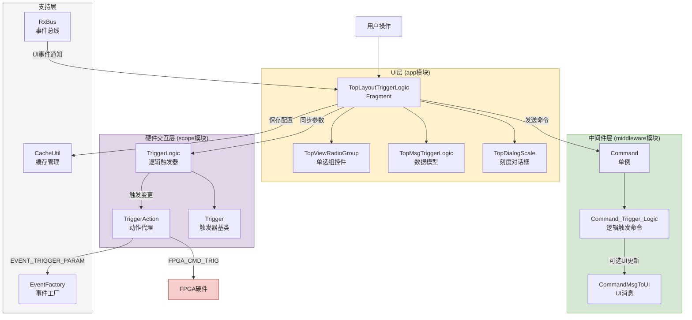
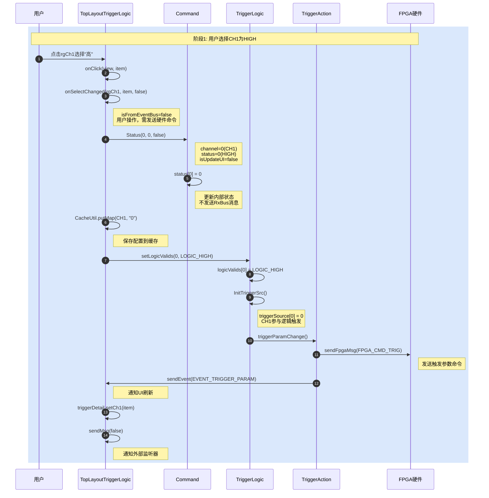
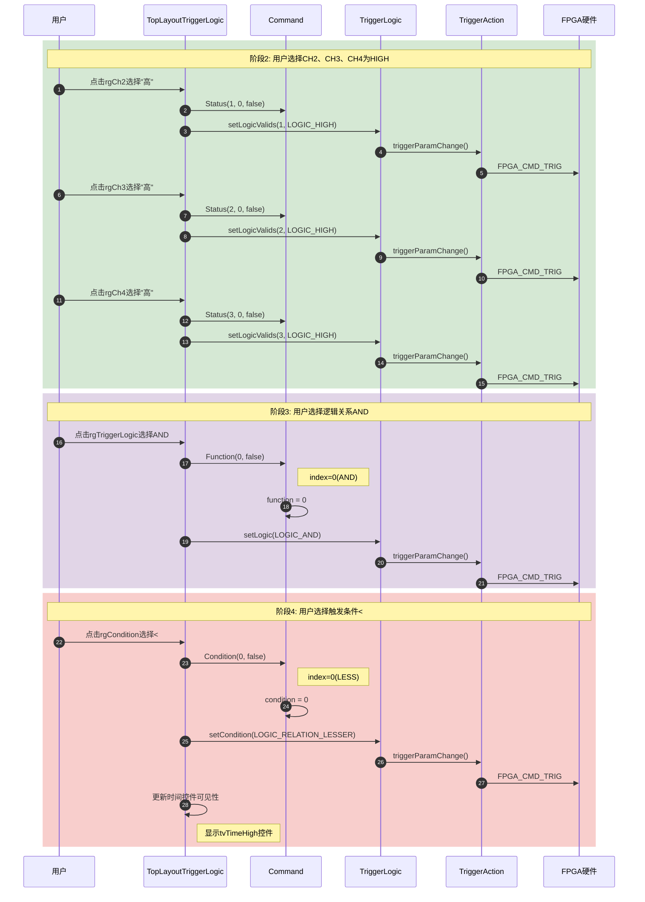
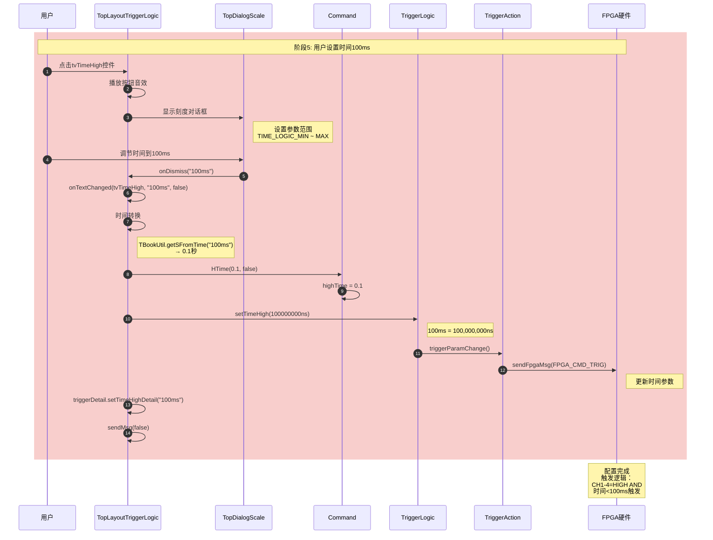
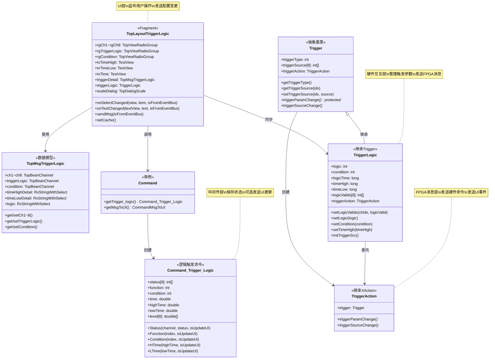
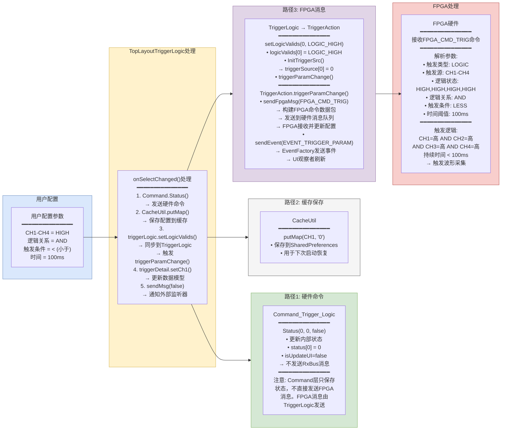
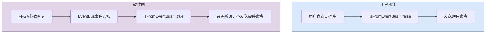
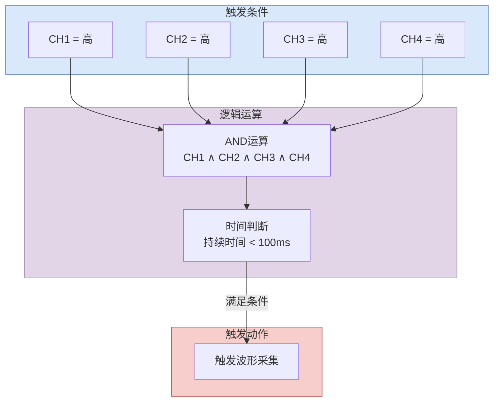

# 逻辑触发器数据流程分析文档

> **用户配置示例**
> - 四个通道触发条件：都选择"高"（HIGH）
> - 逻辑关系：AND
> - 触发条件：`<`（小于）
> - 时间：100ms

---

## 一、整体架构图



---

## 二、详细时序图

### 阶段1：用户选择通道1状态为"高"



### 阶段2-4：用户选择其他通道、逻辑关系、触发条件



### 阶段5：用户设置时间100ms



---

## 三、类调用关系图



---

## 四、数据流向图



---

## 五、isFromEventBus参数说明



| 参数值 | 来源 | 行为 |
|--------|------|------|
| `false` | 用户操作 | 发送硬件命令到FPGA |
| `true` | 硬件同步 | 不发送硬件命令（避免循环），只更新UI |

---

## 六、关键类职责总结

| 类名 | 模块 | 文件路径 | 职责 |
|------|------|----------|------|
| TopLayoutTriggerLogic | app | [TopLayoutTriggerLogic.java](file:///d:/Project/develop_mho_v2/app/src/main/java/com/micsig/tbook/tbookscope/top/layout/trigger/TopLayoutTriggerLogic.java) | UI层，管理界面交互、监听用户操作、发送配置变更 |
| TopMsgTriggerLogic | app | [TopMsgTriggerLogic.java](file:///d:/Project/develop_mho_v2/app/src/main/java/com/micsig/tbook/tbookscope/top/layout/trigger/TopMsgTriggerLogic.java) | 数据模型，存储触发器配置参数 |
| Command | middleware | [Command.java](file:///d:/Project/develop_mho_v2/app/src/main/java/com/micsig/tbook/tbookscope/middleware/command/Command.java) | 命令中间件单例，提供统一的硬件命令接口 |
| Command_Trigger_Logic | middleware | [Command_Trigger_Logic.java](file:///d:/Project/develop_mho_v2/app/src/main/java/com/micsig/tbook/tbookscope/middleware/command/Command_Trigger_Logic.java) | 逻辑触发器命令类，保存状态、可选发送UI更新消息 |
| TriggerLogic | scope | [TriggerLogic.java](file:///d:/Project/develop_mho_v2/scope/src/main/java/com/micsig/tbook/scope/Trigger/TriggerLogic.java) | 硬件交互层，管理逻辑触发参数、发送FPGA消息 |
| TriggerAction | scope | [TriggerAction.java](file:///d:/Project/develop_mho_v2/scope/src/main/java/com/micsig/tbook/scope/Trigger/TriggerAction.java) | 动作代理，发送FPGA命令和UI事件 |
| RxBus | app | [RxBus.java](file:///d:/Project/develop_mho_v2/app/src/main/java/com/micsig/tbook/tbookscope/rxjava/RxBus.java) | RxJava事件总线，用于UI组件间通信 |

---

## 七、完整配置后的FPGA触发逻辑



**触发逻辑表达式：**
```
当 (CH1=高 AND CH2=高 AND CH3=高 AND CH4=高) AND (持续时间 < 100ms) 时，触发波形采集
```

---

## 八、使用说明

### 如何查看Mermaid图表

1. **VS Code**: 安装 "Markdown Preview Mermaid Support" 插件
2. **GitHub**: 直接在GitHub上查看Markdown文件，Mermaid图表会自动渲染
3. **在线工具**: 使用 [Mermaid Live Editor](https://mermaid.live) 编辑和预览
4. **Typora**: 支持Mermaid语法，直接渲染

### 图表类型说明

| 图表 | Mermaid语法 | 用途 |
|------|-------------|------|
| 整体架构图 | `flowchart TB` | 展示系统分层架构 |
| 时序图 | `sequenceDiagram` | 展示交互时序流程 |
| 类调用关系图 | `classDiagram` | 展示类结构和依赖关系 |
| 数据流向图 | `flowchart LR` | 展示数据流转路径 |